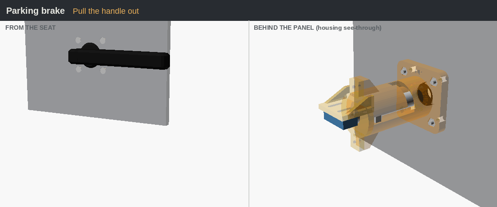
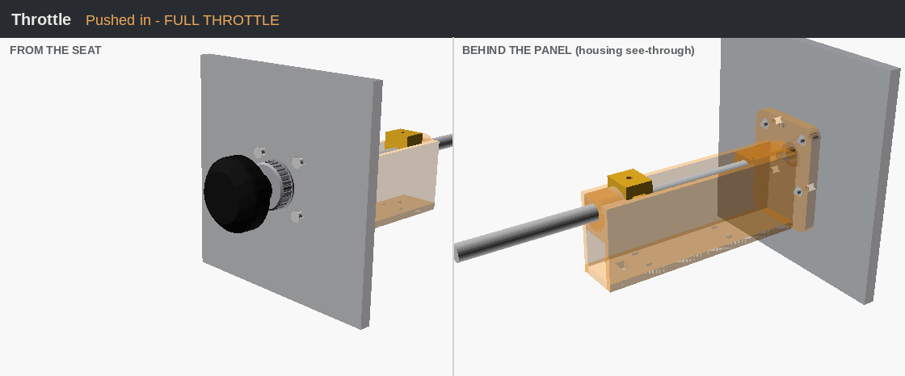
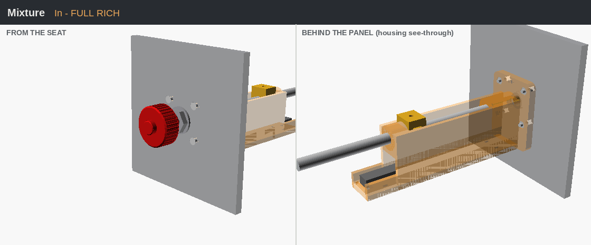
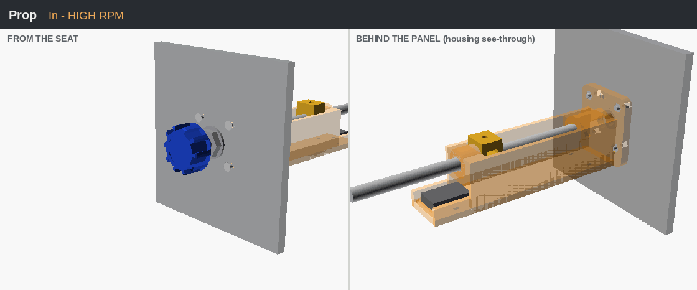
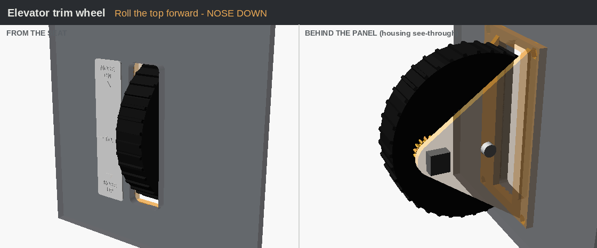
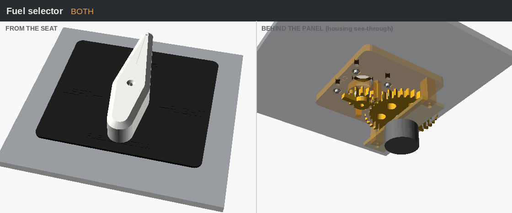
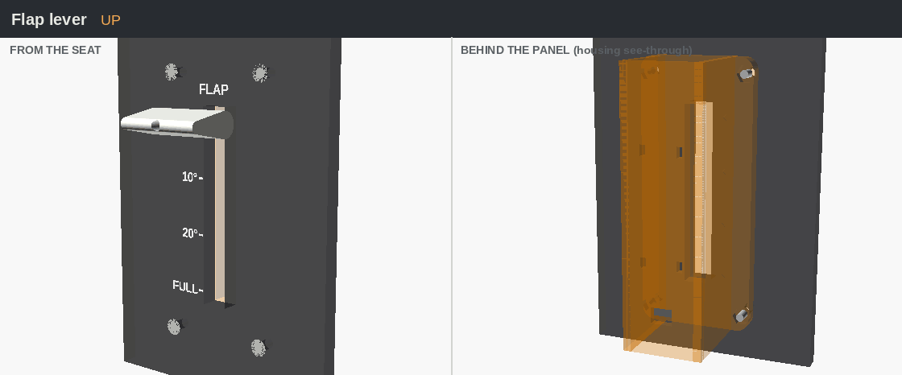
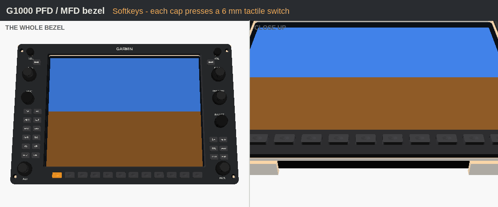
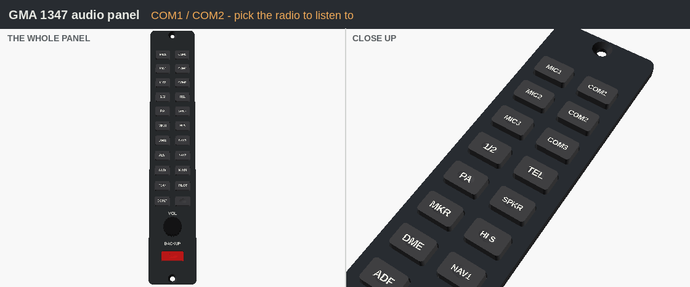
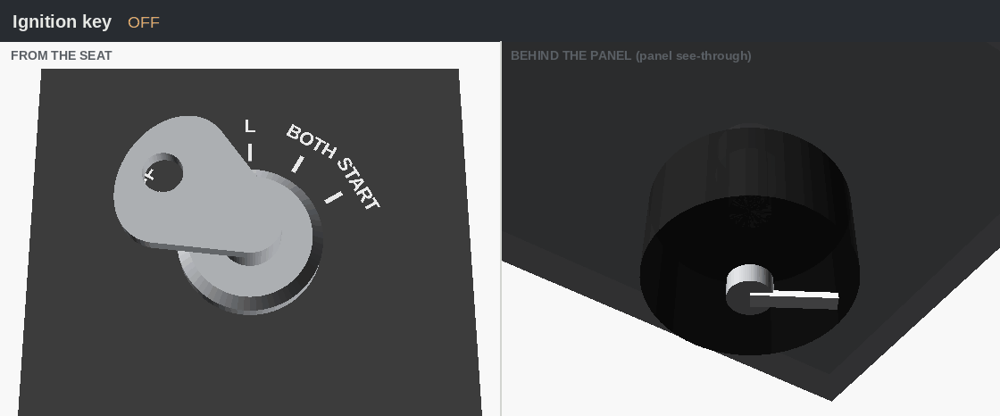

# C172 Home Sim

3D-printable cockpit controls modelled on the Cessna 172, and a full **172S G1000 dashboard** to mount them in. They're built to drive MSFS from a home-built cockpit.

The goal is **parts that look like the real aircraft's, with simple insides**: printed parts, a few screws, and off-the-shelf sensors such as tactile switches, encoders, slide pots, rockers and toggles.


**The G1000 dashboard** ([`panel/`](panel#g1000-dashboard)) is a 172S NAV III panel at real scale, shortened to about 32" (810 mm):

- **Glass:** working PFD and MFD bezels with every real key and knob, each with a 10.4" screen behind it, and a working GMA 1347 audio panel.
- **Switches:** the real C-post and lights panels, and the standby instruments.
- **Lower panel:** ignition key, throttle, mixture, flaps, parking brake and cabin knobs.
- **Pedestal:** trim wheel and fuel selector.
- **Yoke:** an opening for the Moza AY210 shaft.

It prints as 9 tiles sized for a 305 mm bed (QIDI Plus4). On a smaller printer, change `bed` and the seams; OpenSCAD warns if a tile won't fit.

## See them work

Each animation shows the control from the pilot's seat (left) and from behind the panel with the housing see-through (right), so you can watch the mechanism move. The bezels and switch panels show a close-up on the right instead.

**Parking brake**: pull out, rotate down to set, the lug drops into its notch; rotate back up and the spring pulls it home.



**Throttle**: the 8 mm rod slides through the housing and the carriage moves the slide pot. The mixture and prop work the same way.



**Mixture**



**Prop** (optional)



**Elevator trim wheel**: roll the top forward for nose down, back for nose up. The gear on the side of the wheel spins the encoder 3× as fast.



**Fuel selector**: BOTH → LEFT → BOTH → RIGHT. The small gear on the handle turns the big gear on the rotary switch 1/3 as far, so the handle clicks once per tank position.



**Flap lever**: push the handle down through UP → 10° → 20° → FULL. A springy finger on the carriage clicks into a notch at each stop, and the carriage slides a pot like the throttle's.



**G1000 PFD / MFD bezel**: every key cap is a printed T-shape that presses a 6 mm tactile switch on the plate behind; each knob is an EC11 encoder, and the dual knobs are ALPS dual-shaft encoders. Keys are shown lit while pressed.



**GMA 1347 audio panel**: same keys and encoder as the G1000 bezel.



**C-post and lights panels**: off-the-shelf rockers for MASTER and AVIONICS, mini toggles for STBY BATT, lights, fuel pump and pitot heat, and 16 mm pots for the dimmers.


**Ignition key**: OFF → R → L → BOTH → START on a rotary switch. The real key springs back from START; this one you turn back to BOTH yourself.



## Controls

| Control | Looks like | Inside | Sensor |
|---|---|---|---|
| [Parking brake](parts/parking-brake) | Black L-lever; pull and rotate down to set | Spring + bayonet slot | Microswitch |
| [Throttle](parts/throttle) | Smooth round knob, knurled friction nut | 8 mm rod, O-ring friction | 128 mm slide pot (100 mm travel) |
| [Mixture](parts/mixture) | Red ribbed vernier knob with lock button | Same as throttle | 128 mm slide pot (100 mm travel) |
| [Prop](parts/prop) (optional) | Blue crenellated knob | Same as throttle | 128 mm slide pot (100 mm travel) |
| [Elevator trim wheel](parts/trim-wheel) | Black ridged wheel in the pedestal, NOSE DN / T.O. / NOSE UP placard | 608 bearings, 3:1 gear | EC11 encoder |
| [Fuel selector](parts/fuel-selector) | Pointer handle on a LEFT / BOTH / RIGHT placard | 3:1 gear to rotary switch | 1P12T rotary switch |
| [Flap lever](parts/flap-lever) | White flap handle, UP / 10 / 20 / FULL scale | Slide with 4 detent clicks | 128 mm slide pot (100 mm travel) |
| [G1000 PFD / MFD](parts/g1000-gdu) | Garmin GDU 1040 bezel, real size and key layout | Printed caps on tactile switches, 10.4" screen | 32 keys, 9 knobs (EC11 / dual EC11) |
| [Audio panel](parts/g1000-gma) | Garmin GMA 1347 | Same as the G1000 bezel | 22 keys, 1 knob |
| [Switch panels](parts/switch-panel) | C-post (STBY BATT, MASTER, AVIONICS) and lights / dimming | Off-the-shelf rockers, toggles and pots | 18 switches, 4 pots |
| [Standby gauges](parts/standby-gauges) | Airspeed, attitude, altimeter with 172S markings | Printed case, paper face | — (look only) |
| [Panel extras](parts/panel-extras) | Ignition key, ALT STATIC / CABIN HT / AIR / FUEL SHUTOFF knobs, breakers, yoke boot | | Rotary switch (key) |
| [Panels](panel) | **G1000 dashboard**, or the simple lower panel + pedestal | Tiled for printing | — |
| [Firmware](firmware) | Pro Micro joystick sketch + [G1000 wiring and MobiFlight guide](firmware/G1000_WIRING.md) | | Pro Micro + 3 × Arduino Mega |

The Moza AY210 yoke has its own buttons and hats, so those aren't modelled. With the base behind the dashboard, its 13-switch panel is out of reach, so the C-post and lights panels take over.

## Panel mounting (same for every control)

Every control bolts behind the panel the same way. Four **M3 countersunk screws** go in from the front, through the control's flange, into **M3 nuts captured in the back of the flange**. The screw heads sit flush, like the real panel. Each control folder has a `panel-template/` (SVG to print 1:1, DXF for laser/CNC) and a `panel_test_plate` STL for test-fitting.

## Moving the controls

On the **G1000 dashboard**, every position is a setting near the top of [`panel/g1000_dashboard.scad`](panel/g1000_dashboard.scad); see [its README](panel#changing-the-layout). The guide below is for the **simple lower panel**, which also has the drag-and-drop layout page.

Every control on the simple printable panel can be moved. The positions are plain numbers in [`panel/c172_panel.scad`](panel/c172_panel.scad). Change them, re-render, and the panel cutouts, countersinks and labels all move with them.


The numbers are in millimetres, as seen from the pilot's seat:
- **x** is how far right of the panel centre (negative = left).
- **y** is how far up from the bottom edge of the panel.

Each control's position is the centre of its knob or shaft.

### What you can move

| Setting | What it moves | Default |
|---|---|---|
| `brake_pos` | Parking brake | `[-140, 45]` |
| `throttle_pos` | Throttle | `[0, 70]` |
| `mixture_pos` | Mixture | `[60, 70]` |
| `mixture_pos_with_prop` | Mixture, used instead when `has_prop = true` | `[110, 70]` |
| `prop_pos` | Prop (only when `has_prop = true`) | `[55, 70]` |
| `has_prop` | Adds the prop control between the throttle and mixture | `false` |
| `pedestal_x` | Moves the whole pedestal (trim wheel + fuel selector) left/right | `30` |
| `lower_w`, `lower_h` | Size of the lower panel | `330`, `120` |
| `pedestal_w`, `pedestal_h`, `floor_d` | Size of the pedestal face and floor plate | `130`, `170`, `150` |
| `yoke_hole` | Cuts a yoke-shaft opening: `[x, y, width, height]`, or `[]` for none | `[]` |
| `labels` | Engraved THROTTLE / MIXTURE / ... labels on or off | `true` |
| `lower_splits` | Where the lower panel is split into print tiles (x positions) | `[-75]` |
| `bed` | Your printer's bed size, so tiles are checked to fit | `305` (QIDI Plus4) |

### Easiest: drag them around in the layout page

Download [`tools/panel-layout.html`](tools/panel-layout.html) (*Raw* → save) and open it in your browser.

- Drag the controls, the pedestal, the tile seams and the yoke opening on a to-scale drawing of the panel.
- It runs the same checks as the OpenSCAD file as you drag (overlaps, edges, seams, bed size). It also warns if the parking brake handle would swing into a knob or hang in front of the pedestal.
- Press **Copy settings** and paste the lines over the layout section of `panel/c172_panel.scad`, then run `scripts/render.sh panel`.
- It can also load the settings from your current file, so you can keep tweaking an existing layout.

### Or in OpenSCAD's Customizer

1. Install [OpenSCAD](https://openscad.org) and open `panel/c172_panel.scad`.
2. Open *Window → Customizer*. The settings above appear under **Layout - lower panel**, **Layout - pedestal** and **Printing**.
3. Change a value, for example `throttle_pos` to `[-10, 75]`. Press **F5** to see the whole cockpit with every control in its new place.
4. Check the console at the bottom for a **WARNING**. The file checks itself and warns if:
   - two controls are too close (their flanges behind the panel need about **46 mm** between centres),
   - a control hangs off the edge of the panel (keep it at least **21 mm** from every edge),
   - a tile seam cuts through a control (move the seam in `lower_splits`),
   - a tile is wider than your bed.
5. When it looks right, pick a piece in `part` (e.g. `lower_tile_1`), press **F6** to render, then **File → Export → STL**. Repeat for each piece you need.

### Or from the command line

Edit the numbers in the file, then rebuild every panel STL, the templates and the preview images:

```bash
scripts/render.sh panel
```

You can also try a layout without editing the file:

```bash
openscad -D 'throttle_pos=[-10,75]' -D 'mixture_pos=[55,75]' -D 'part="preview"' -o test.png panel/c172_panel.scad
```

### Tips

- **Match the sim cockpit.** In VR it matters more than anything that the real knob sits where your hand sees the virtual one. Measure from the sim's cockpit (or your yoke) and move the controls to match.
- **Adding a split:** if you make the panel wider, add more tile seams, e.g. `lower_splits = [-75, 90]`. The panel can be split into up to 3 tiles (`lower_tile_1` to `lower_tile_3`). Put each seam in a gap between controls.
- **Leave the trim wheel and fuel selector on the pedestal.** To move them, change `pedestal_x`, `pedestal_w`, `pedestal_h` or `floor_d`; the parts stay centred on their plates.
- **Pre-made controls.** The individual controls (`parts/...`) don't need re-rendering when you move them; only the panel changes.

## Layout

```
common/            shared settings (panel thickness, fit, M3 hardware, mount pattern, gears)
  push_pull.scad   shared throttle / mixture / prop mechanism
parts/<control>/
  <control>.scad   parametric source (OpenSCAD Customizer)
  stl/             print-ready STLs, already in print orientation
  panel-template/  cutout drawing
  images/          renders
  README.md        parts list, printing, assembly, wiring, MSFS binding
panel/             g1000_dashboard.scad (full dashboard) + c172_panel.scad (simple lower panel)
  dashboard/       dashboard tiles, glareshield, pedestal STLs + full-size templates
firmware/          Arduino Pro Micro sketch, G1000 wiring / MobiFlight guide (G1000_WIRING.md)
tools/             panel-layout.html: drag-and-drop panel layout page
scripts/render.sh  regenerate STLs/templates for the controls
```

## Rebuilding after changes

```bash
scripts/render.sh                  # all controls + both panels
scripts/render.sh throttle         # one control
scripts/render.sh dashboard        # the G1000 dashboard tiles, glareshield, pedestal
scripts/render.sh panel            # the simple lower panel
PANEL=3 scripts/render.sh          # for a 3 mm panel
```

Everything needs OpenSCAD 2021.01 or newer. To re-make the animations above after a change, run `python3 scripts/make_gifs.py` (needs Pillow). The script runs on Linux, macOS, or Windows with Git Bash or WSL.

## Status

Every moving part has been checked in OpenSCAD for collisions through its full range of movement, but **nothing has been test-printed yet**. Expect to tune `clearance` for your printer. Dimensions are approximated from photos of real 172 parts, not factory drawings.

## License

MIT. See [LICENSE](LICENSE).
