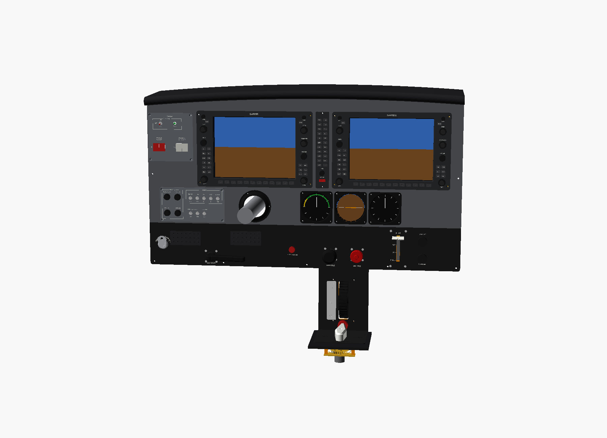
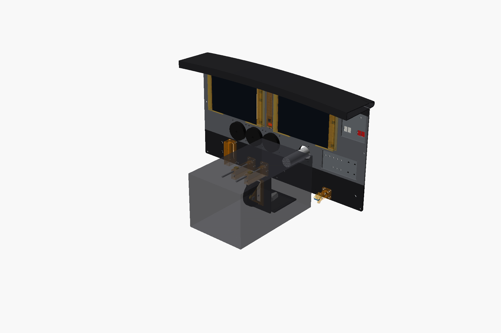
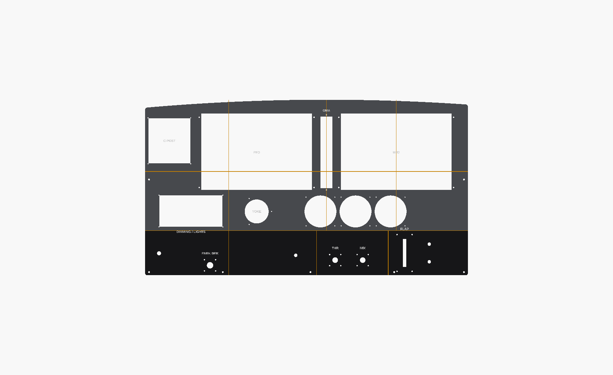
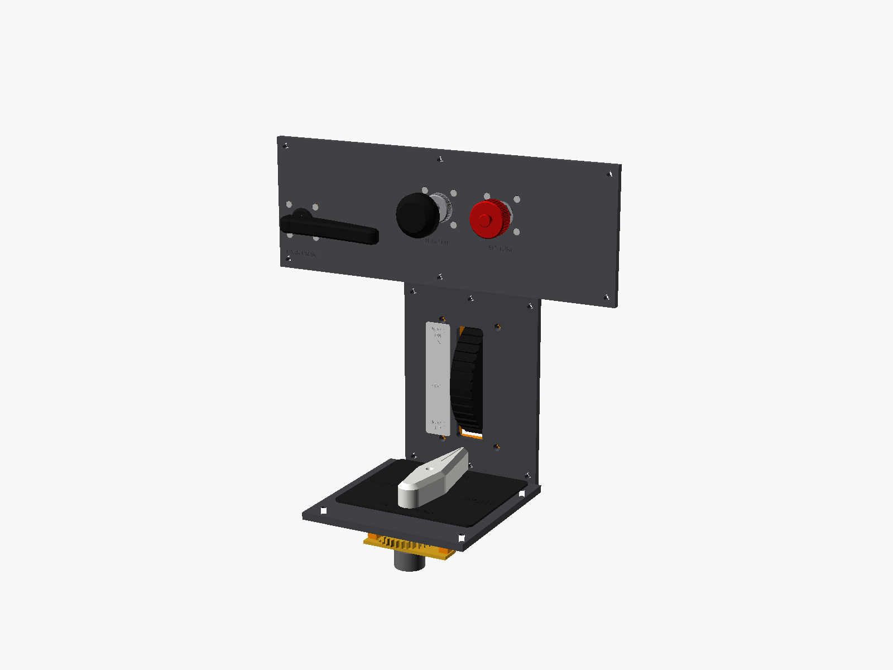
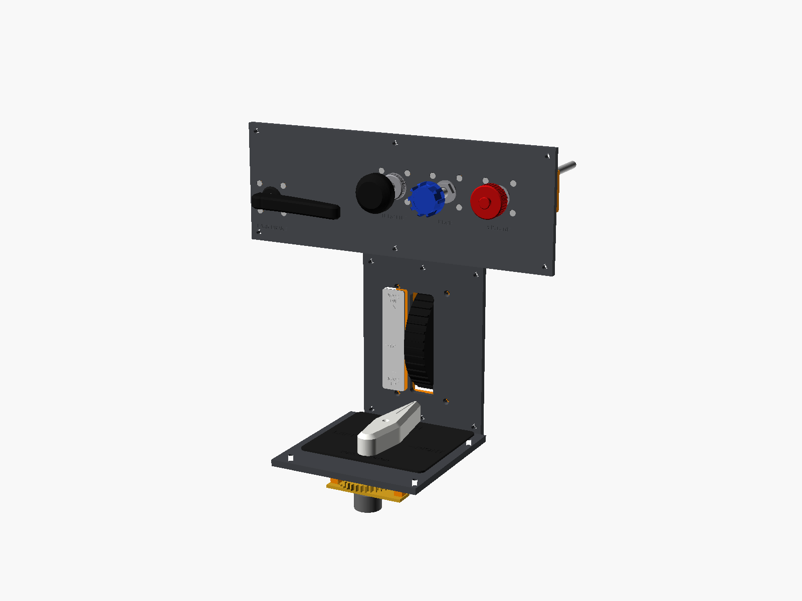
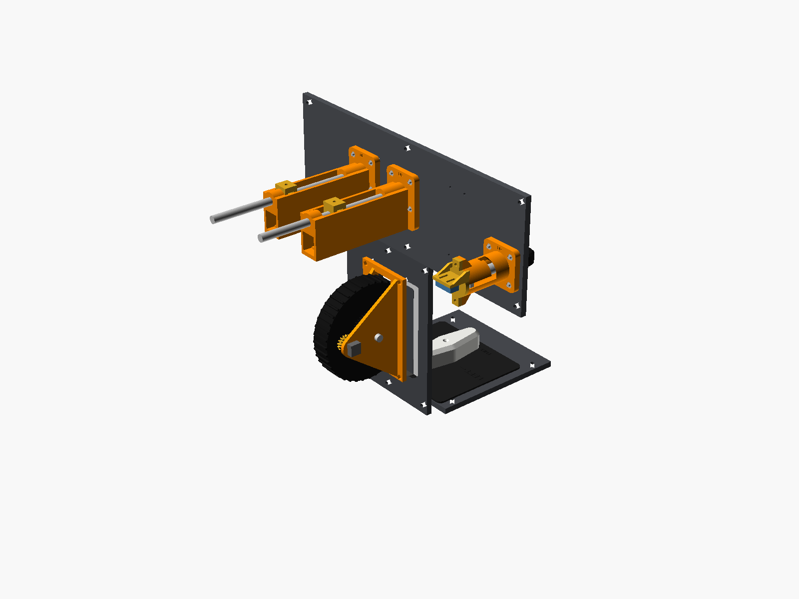
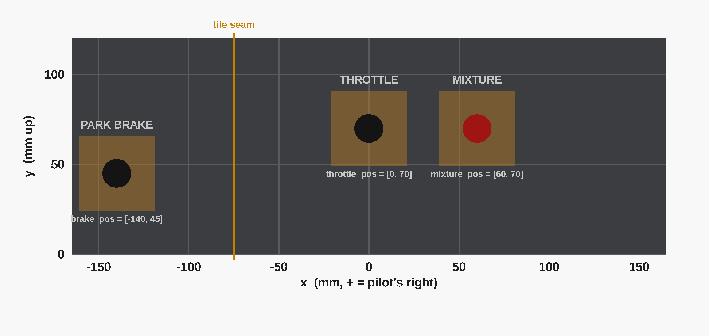

# Printable Panels

There are two panel options:

1. **[G1000 dashboard](#g1000-dashboard)**: the full 172S G1000 panel, shortened to about 32" (810 mm), with every control. This is the main one.
2. **[Simple lower panel](#simple-lower-panel)**: just the parking brake, throttle, mixture (and prop) plus the pedestal. Good for testing the controls before building the whole dashboard.

---

## G1000 dashboard

| Behind the panel (AY210 base shown as a grey box) | Layout and print tiles |
|---|---|
|  |  |

Laid out from photos of the real 172S NAV III panel and kept at real scale; only the copilot side is cut off.

| Area | What's there |
|---|---|
| Upper (grey) | C-post switches, PFD, GMA 1347 audio panel, MFD, dimming/lights panel, yoke shaft opening, standby airspeed / attitude / altimeter |
| Lower (black) | Ignition key, circuit breakers (look only), parking brake, ALT STATIC AIR, throttle, mixture, flap lever, cabin heat / cabin air |
| Pedestal | Elevator trim wheel, fuel shutoff knob, floor plate with the fuel selector |
| Top | Glareshield in 4 segments |

### Printing it

- **Tiles:** 12 of them, 4 columns × 3 rows. Row L (lower) in black; rows M and U in grey. Print them **front face down**. The largest is 245 × 180 mm.
- **Joining:** the modules (bezels, switch plates, instruments) sit over the seams and screw into the tiles on both sides, which ties the panel together. Add the 34 × 70 mm `splice` plates on the back where the seams are clear (blind pilot holes are already there).
- **Glareshield:** 4 segments. Print them upside down with tree supports, or use them as formers and cover with foam and vinyl like the real padded one.
- **Pedestal:** the face and floor plates.
- **Plywood instead:** [`dashboard/templates/`](dashboard/templates) has the full panel as SVG/DXF (front view) for a laser or CNC.
- **Mounting to your frame:** 4.5 mm holes along the bottom edge and the sides take #8 / M4 screws.

STLs are in [`dashboard/stl/`](dashboard/stl). After changing anything, regenerate them with `scripts/render.sh dashboard`.

### Fitting it to your Moza AY210

The yoke shaft comes through a 60 mm hole in front of the pilot (`yoke_pos`, default 160 mm up from the panel bottom), with a printed boot ring round it.

- **Shaft height:** set `moza_shaft_h` to the height of the AY210 shaft above the bottom of its base. Measure yours: Moza doesn't publish it, and the default 150 mm is a guess. Then set the panel height so the hole lines up with the shaft.
- **Clearance:** the base sits behind the panel. `moza_front` is the gap from the panel back to the base's front face; keep it above about 80 mm so the parking brake and the PFD screen clear it. The file warns if they'd collide.
- **Base switches:** the AY210's own 13-switch panel will be out of reach behind the dashboard, so the C-post and lights panel take over.

### Changing the layout

Every position is a setting near the top of [`g1000_dashboard.scad`](g1000_dashboard.scad), in mm from the pilot's centre line (`x`, + = right) and up from the panel bottom (`y`): `pfd_pos`, `gma_pos`, `mfd_pos`, `cpost_pos`, `lights_pos`, `gauge_*`, `yoke_pos`, `ignition_pos`, `brake_pos`, `throttle_pos`, `mixture_pos`, `flap_pos`, and so on. You can also change the panel width (`x_left`, `x_right`), the top arch, the tile seams and your `bed` size. OpenSCAD warns if a tile won't fit your printer.

---

## Simple lower panel

Panel pieces with every control's cutouts, mounting holes and countersinks already in place. The layout follows the 172S lower panel and centre pedestal.

| With the optional prop control | Behind the panel |
|---|---|
|  |  |

## Pieces

| Piece | What's on it | Size | STL |
|---|---|---|---|
| Lower panel | Parking brake, throttle, (prop), mixture, engraved labels | 330 × 120 mm, split into 2 tiles | `lower_tile_1`, `lower_tile_2` + `splice` |
| Pedestal face | Trim wheel slot + placard outline | 130 × 170 mm | `pedestal` |
| Pedestal floor | Fuel selector | 150 × 150 mm | `floor` |

- **Thickness:** all pieces are `panel_thickness` thick (6.35 mm by default, set in `common/sim_common.scad`).
- **Printing:** print **front face down** for a smooth face; the engraved labels print correctly that way.
- **Joining the lower panel:** the tiles butt together. Glue the `splice` strip across the seam on the back, plus 4 × M3 × 10 screws into the blind pilot holes.
- **Mounting:** the 4.5 mm holes around the edges are for #8 or M4 screws into your frame.
- **Cutting from plywood instead:** [`templates/`](templates) has full-size SVG and DXF files (front view) for a laser or CNC, or to print and drill through.

## Changing the layout

The easiest way is the drag-and-drop page [`tools/panel-layout.html`](../tools/panel-layout.html). See **[Moving the controls](../README.md#moving-the-controls)** in the main README for the full guide.

Open `c172_panel.scad` in OpenSCAD and use the Customizer:

- **Control positions:** `brake_pos`, `throttle_pos`, `prop_pos`, `mixture_pos`, in mm right of panel centre and up from the panel bottom.
- **Prop:** `has_prop` adds the blue prop knob between the throttle and mixture.
- **Yoke:** `yoke_hole = [x, y, w, h]` cuts an opening for a yoke shaft. Your Moza AY210 sits on the desk, so leave it empty unless the yoke shaft has to pass through this panel.
- **Labels:** `labels` turns the engraved labels on or off.
- **Bed size:** `bed` (your print bed size) and `lower_splits` (where tiles split). OpenSCAD warns if a tile is too big.

The positions are approximate 172S proportions taken from photos, not from factory drawings. Move them to suit your seat, yoke and monitor.

## Not included (already on your Moza AY210)

The AY210 base has its own 13-switch panel, and the yoke has the buttons and hats. So master, avionics, lights and magneto switches aren't modelled here.
