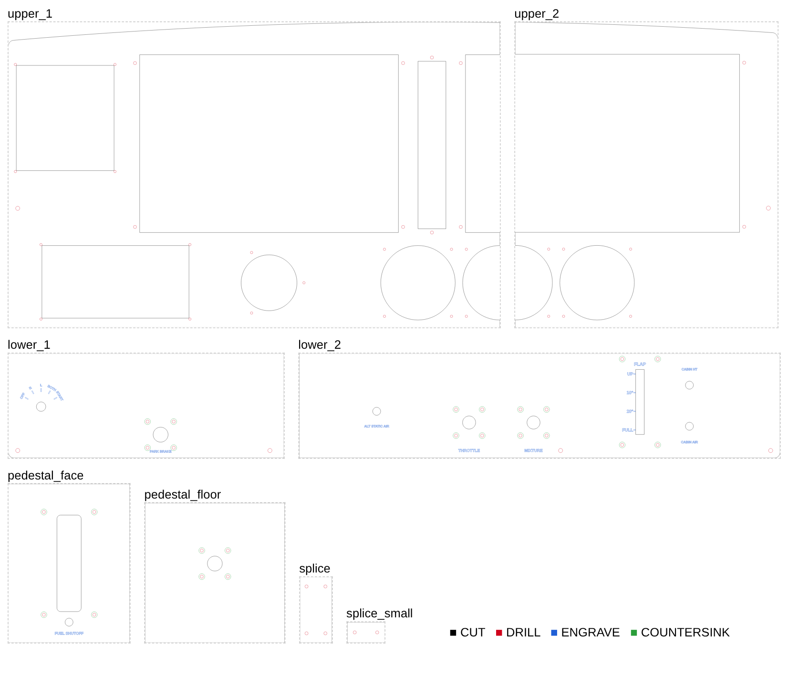

# Cutting the dashboard on a CNC router

Files for cutting the G1000 dashboard panel from **1/4" (6.35 mm) plywood or MDF** on an 800 × 400 mm router (FoxAlien XE-PRO with the 8040 extension, or similar), instead of printing the tiles.



## The pieces

| File | Piece | Size (mm) |
|---|---|---|
| `upper_1` | Upper (grey) panel, left: C-post, PFD, audio panel, lights panel, yoke, airspeed + half the attitude gauge | 528 × 328 |
| `upper_2` | Upper panel, right: MFD, other half of the attitude gauge, altimeter | 282 × 327 |
| `lower_1` | Lower (black) panel, left: ignition, parking brake | 295 × 112 |
| `lower_2` | Lower panel, right: alt static, throttle, mixture, flaps, cabin heat / air | 515 × 112 |
| `pedestal_face` | Pedestal: trim wheel, fuel shutoff | 130 × 170 |
| `pedestal_floor` | Pedestal floor: fuel selector | 150 × 150 |
| `splice` | Joining plate, 34 × 70 (cut 3) | 34 × 70 |
| `splice_small` | Small joining plate, 40 × 22 (cut 3) | 40 × 22 |

The full panel is 810 mm wide, a little more than the 800 mm X travel, so the lower and upper panels are each cut in two. The upper seam runs through the attitude gauge and the MFD: both bezels screw into both pieces and tie them together. Splice plates on the back join the lower seam and the joint between the lower and upper panels.

## Files

Each piece has a `.dxf` and an `.svg` with the same content. Use whichever your CAM program imports better. Units are mm, viewed from the front, with the piece's lower-left corner at 0,0. Each file has one layer (DXF) or colour (SVG) per operation:

| Layer | Colour | What it is | Suggested tool |
|---|---|---|---|
| `CUT` | black | Outline (outside profile) and openings (inside profiles), cut through | 1/8" (3.175 mm) 2-flute upcut or compression end mill |
| `DRILL` | red | Small through holes as circles: M3 clearance (3.4 mm), pilot (2.6 mm), frame screws (4.5 mm) | Peck-drill with the 1/8" bit, then open to size by hand |
| `ENGRAVE` | blue | Labels: THROTTLE, MIXTURE, flap scale, ignition positions, and so on | 60° or 90° V-bit, 0.6 mm deep |
| `COUNTERSINK` | green | Circles the size of an M3 countersunk head (6.4 mm), around the control mounting holes | 90° V-bit plunged 3.2 mm at the centre, or a countersink bit by hand |

`<piece>_back.dxf` / `.svg` hold the **blind pilot holes on the back**, for the G1000 screen cradles, the splice plates and the glareshield. They're mirrored left to right and include the outline, so they line up after you flip the piece. Drill them **4 mm deep, not through**. If you'd rather not flip pieces on the machine, measure them from the outline and drill them by hand with a depth stop.

## Cutting order (front face up)

1. Clamp a sheet at least 20 mm bigger than the piece on every side, so the clamps stay clear of the outline. Zero X/Y at the lower-left corner of the piece and Z on the top of the sheet.
2. **ENGRAVE** first, while the sheet is flat and solid.
3. **COUNTERSINK**, then **DRILL**.
4. **CUT**: the openings first, then the outline with tabs. In 1/4" plywood, take about 1.5 mm per pass and cut 0.3 mm into the spoil board. A starting point for a 1/8" end mill is 800 mm/min. Listen to the cut and adjust for your spindle and wood.
5. Clean up the tabs. Open the M3 clearance holes to 3.4–3.5 mm and the frame holes to 4.5 mm with a hand drill.

Inside corners of the openings come out rounded to the bit radius. That's fine with a 1/8" bit: everything that sits in an opening has corners rounded at least that much. Don't use a bigger bit for the openings.

## Putting it together

- **Splice plates:** lay the pieces face down on a flat table. Glue each plate over its blind pilot holes (they show where it goes: 1 across the lower seam, 5 along the lower/upper joint) and screw it down with **#4 × 3/8" wood screws** or **M3 × 10** (any longer and they come through the front).
- **Upper seam:** fit the attitude gauge and the MFD bezel; their screws hold the two upper pieces in line. The printed glareshield crosses it too and screws into both pieces.
- **Frame:** screw the panel to your frame through the frame holes along the bottom and sides.
- **Finish:** paint the lower panel black and the upper panel grey (the 172S colours), then fill the engraved labels with white paint and sand the face lightly.
- **Screws:** the controls and bezels use the same M3 screws as the printed tiles. In wood, M3 machine screws into the 2.6 mm pilot holes hold well enough, or use #4 wood screws.

## Changing it

The splits and the hole size that counts as "drill" are settings in [`../../g1000_dashboard.scad`](../../g1000_dashboard.scad) under **CNC router**: `cnc_lower_split`, `cnc_upper_split`, `cnc_drill_max`. Every control position in the dashboard file feeds into these files too. After a change, run:

```bash
python3 scripts/make_cnc.py
```

(It needs OpenSCAD. `scripts/render.sh dashboard` runs it as well.)
