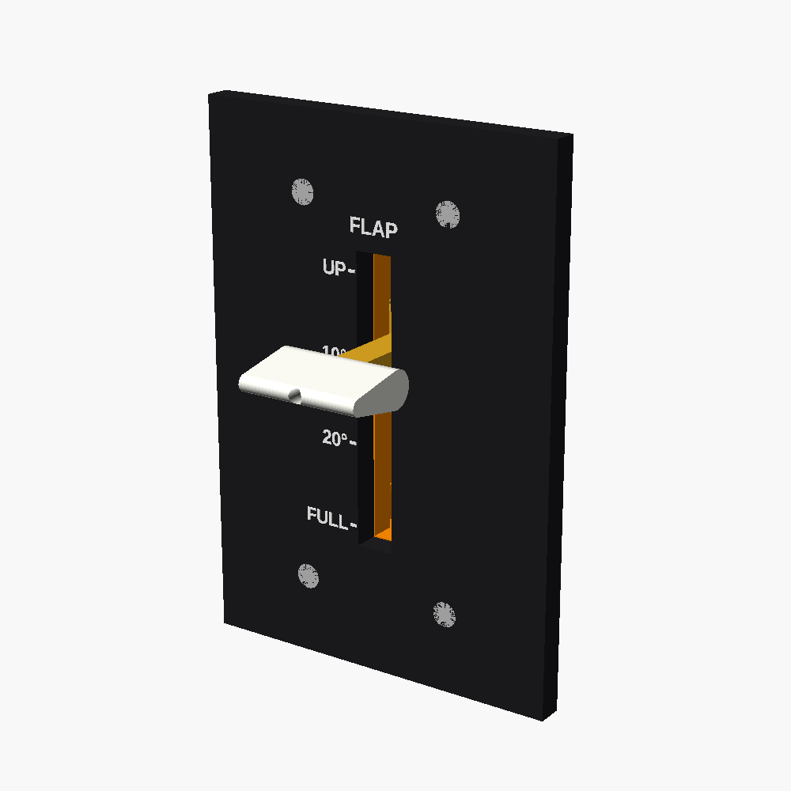

# Flap lever

The 172S flap lever: a small white handle that moves up and down a slot with clicks at **UP, 10°, 20° and FULL**. The scale is engraved in the dashboard beside it.

## How it works (kept simple)

- **Housing:** a printed channel bolted behind the panel (4 × M3 countersunk screws into captive nuts).
- **Carriage:** slides in the channel. Its stem passes through the slot to the handle.
- **Detents:** a springy printed finger on the carriage clicks into 4 notches 20 mm apart.
- **Sensor:** the carriage drives the same **128 mm slide pot** as the throttle (it uses about 60 mm of its 100 mm travel; the pot is longer than the housing, so two narrow channels carry its ends). Wire it to A3 on the Pro Micro (set `HAS_FLAPS = true` in the sketch) and bind the Rx axis to *Flaps axis* in MSFS.

## Parts list

| Qty | Item |
|---|---|
| 1 each | Printed `housing`, `carriage`, `handle` (white) |
| 1 | Slide pot, 10 kΩ linear, 128 mm long / 100 mm travel (set `pot_len`, `pot_travel` etc. for another size) |
| 4 + 4 | M3 × 14 countersunk screws + nuts |
| 1 | M3 × 12 screw (handle to stem) |
| 2 | Zip ties (pot) |

Print the carriage in PETG if you can; the detent finger lasts longer than in PLA. If the clicks are too stiff or too soft, sand the bump or change the gap in `carriage()`.
