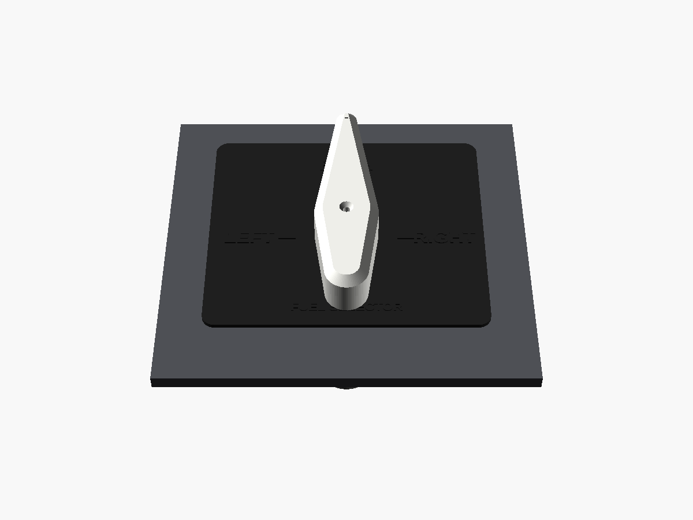
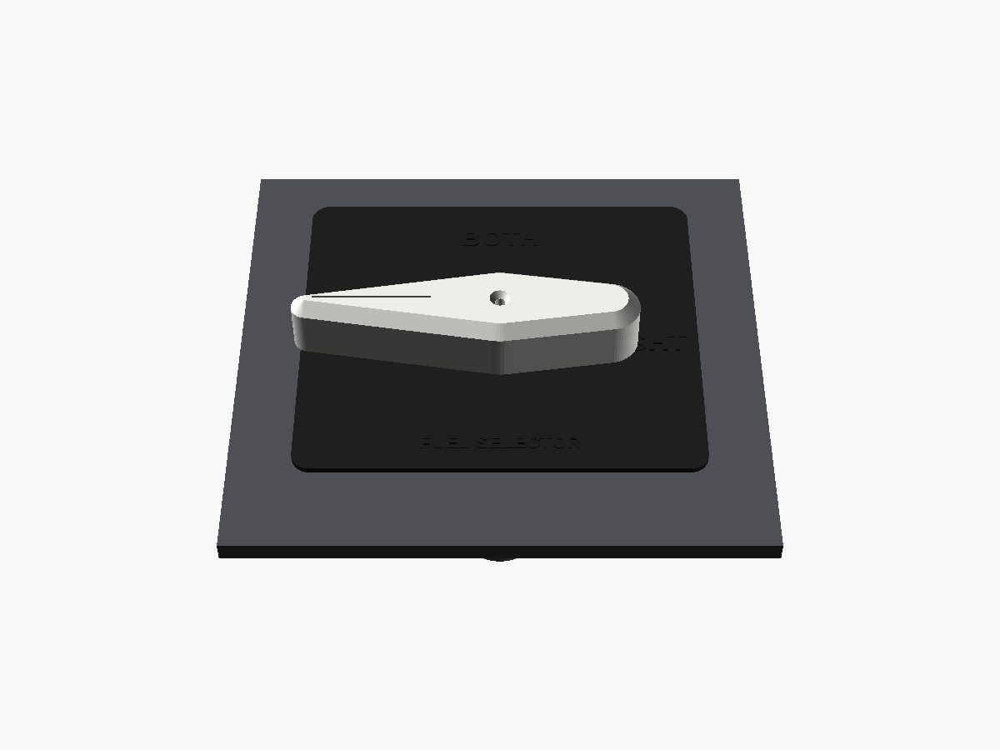
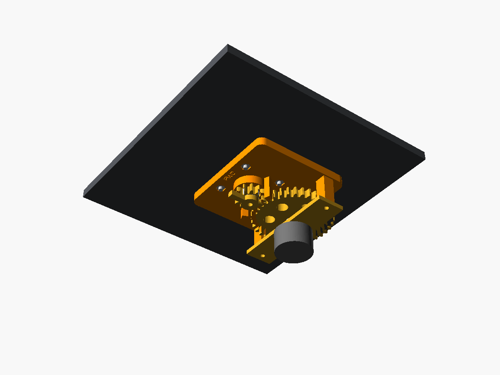

# Fuel Selector

The pointer handle on the pedestal floor, over a LEFT / BOTH / RIGHT placard, as in the 172S. For older 172s that have OFF on the selector, set `has_off = true`.

| Pointing BOTH | Pointing LEFT | Underneath |
|---|---|---|
|  |  |  |

## How it works (kept simple)

- **Gearing:** the handle shaft carries a 12-tooth gear that turns a 36-tooth gear on a standard **1-pole 12-position rotary switch**. The switch clicks every 30°, so with the 3:1 reduction the handle clicks every 90°: one click per tank position.
- **Stops:** an arm on the handle gear hits two printed stops at LEFT and RIGHT, so the stop washer inside the switch never takes the load. With `has_off = true` the printed stops are removed, so set the switch's own stop washer to 4 positions.

## Parts list

| Qty | Item | Notes |
|---|---|---|
| 1 each | Printed: `handle`, `shaft`, `handle_gear`, `switch_gear`, `housing`, `switch_bracket`, `placard` | [`stl/`](stl) |
| 1 | 1P12T rotary switch (3/8" bushing, 6 mm shaft) | The shaft must reach 20 mm past the mounting face. Cut longer shafts. |
| 2 | M3 × 12 screws | Handle → shaft (from the top), gear → shaft (from below) |
| 2 | M3 × 8 screws | Switch bracket → posts |
| 4 + 4 | M3 × 14 countersunk screws + M3 nuts | Floor-plate mount |

## Printing

No supports are needed. The handle prints flat-side down; print it in white or cream. The placard prints face up; paint the plate black and dry-brush the letters white.

## Assembly

1. Bolt the housing under the floor plate with "FWD" toward the panel.
2. Push the shaft up through the boss (D-flat facing forward). Put the placard and handle on top and screw the handle down.
3. From below, push the handle gear onto the shaft with its arm pointing forward, and screw it on.
4. Turn the handle to BOTH. Fit the switch in the bracket, press the big gear onto the switch shaft so the two gears mesh, and screw the bracket onto the posts. Check that LEFT, BOTH and RIGHT each land on a click.

## Wiring and sim

Wire the switch common to GND. The three switch positions the handle reaches go to pins 3 (LEFT), 4 (BOTH) and 5 (RIGHT), plus pin 6 for OFF if you built it. The Pro Micro sketch in [`/firmware`](../../firmware) holds button 4, 5, 6 or 7 for the selected position.

In MSFS, bind them to the fuel selector left / both (all) / right events. With MobiFlight, use `(>K:FUEL_SELECTOR_LEFT)`, `(>K:FUEL_SELECTOR_ALL)`, `(>K:FUEL_SELECTOR_RIGHT)` and `(>K:FUEL_SELECTOR_OFF)` on press. Some add-on aircraft use their own variables, so check on the ground first.
