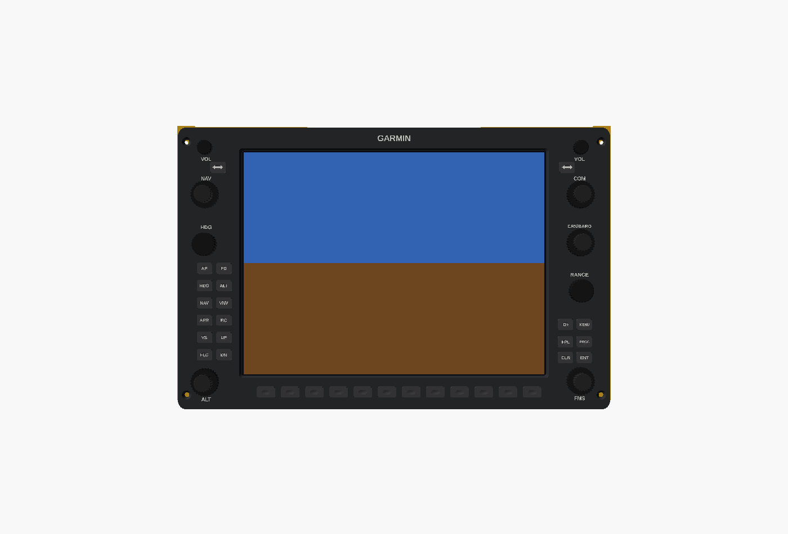
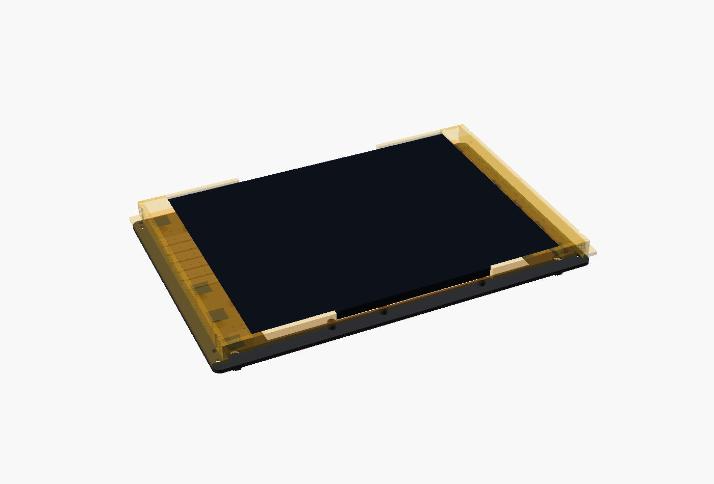
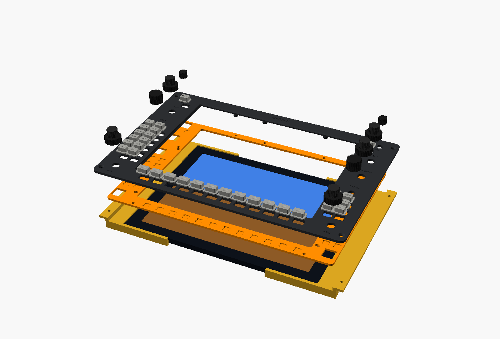

# G1000 PFD / MFD bezel (GDU 1040)

A working copy of the Garmin GDU 1040 bezel at real size (300 × 196 mm), with the real key and knob layout. Build two: one for the PFD and one for the MFD (the real units are identical).

| Behind the panel | Exploded |
|---|---|
|  |  |

## What's on it

- **Keys:** 12 softkeys, NAV and COM frequency flip keys, the 12 GFC 700 autopilot keys (AP FD / HDG ALT / NAV VNV / APR BC / VS UP / FLC DN), and the 6 FMS keys (D→ MENU / FPL PROC / CLR ENT).
- **Knobs:** NAV VOL, NAV (dual), HDG, ALT (dual), COM VOL, COM (dual), CRS/BARO (dual), RANGE and FMS (dual).
- **Screen:** a 10.4" 4:3 1024×768 LCD, the same size and resolution as the real one, showing MSFS's popped-out PFD or MFD.

## How it's built (kept simple)

- **Front plate:** printed face down with engraved labels; fill them with white paint. If your bed is under 300 mm, print `front_left` + `front_right`; the seam runs between softkeys 6 and 7. The 4 corner screws into the panel hold the halves in line.
- **Key caps:** T-shaped. The flange behind the plate keeps them in and presses a standard **6×6×5 mm tactile switch**. Print them flange-down (`caps_sheet`) in dark grey and paint the engraved labels white.
- **Switch plate:** holds the tactile switches in pockets (legs through, solder on the back). It screws to 9 posts on the back of the front plate. It's split at a different place from the front plate, so it bridges that seam.
- **Encoders:** EC11 (single) and ALPS EC11 dual-shaft (e.g. EC11EBB24C03: 6 mm outer, 3.5 mm inner). They mount in the front plate with their nut on the face, and the knob hides the nut.
- **Screen cradle:** two C-shaped halves screwed to the back of the panel (not the bezel), so the bezel comes off without disturbing the screen. The screen sits about 15 mm behind the face, clear of the switch legs; the real G1000 glass is recessed too.

## Parts list (per bezel)

| Qty | Item |
|---|---|
| 1 | Printed front plate (or left + right halves), 2 switch-plate halves, 2 cradle halves, caps sheet, knobs sheet |
| 32 | 6×6×5 mm tactile switches (through-hole) |
| 5 | Dual-shaft EC11 encoders (ALPS EC11EBB24C03 or similar) |
| 4 | Single EC11 encoders with push switch, 6 mm D shaft |
| 1 | 10.4" 1024×768 LCD with HDMI driver board |
| 9 | M3 × 8 screws (switch plate to posts) |
| 4 + 4 | M3 × 16 countersunk screws + nuts (bezel to panel) |
| 4 | M3 × 10 screws (cradle to panel back) |
| 1 | Arduino Mega 2560 (MobiFlight), see [`firmware/G1000_WIRING.md`](../../firmware/G1000_WIRING.md) |

## Notes

- The ALPS dual encoders don't have a push switch, so PUSH 1-2, PUSH CRS CTR and PUSH CRSR aren't available. Use dual encoders with a push switch (e.g. Propwash) if you want them; the holes take a 9 mm bushing.
- Settings: `ap_keys` (turn the autopilot keys off), and `lcd_w` / `lcd_h` / `lcd_t` for your screen.
- The key positions were measured from Garmin's published bezel drawing and photos, so they're close but not exact.
