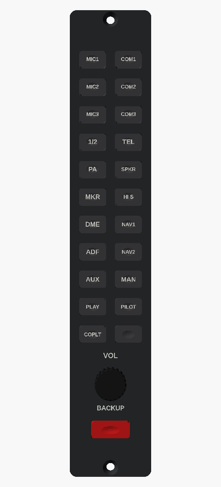

# GMA 1347 audio panel

The narrow audio panel between the PFD and MFD, at real size (34.3 × 195.6 mm): 21 audio keys, the volume knob, and the red DISPLAY BACKUP button. It's built the same way as the [G1000 bezel](../g1000-gdu): printed face, T-shaped key caps on 6×6 mm tactile switches, and a printed switch plate.

## Parts list

| Qty | Item |
|---|---|
| 1 each | Printed `front`, `switch_plate`, `caps_sheet` (print the last cap in red: it's DISPLAY BACKUP), `knob` |
| 22 | 6×6×5 mm tactile switches |
| 1 | EC11 encoder with push switch |
| 2 + 2 | M3 × 8 screws (switch plate), M3 × 16 countersunk screws + nuts (to the panel) |

It's wired to board 3 in [`firmware/G1000_WIRING.md`](../../firmware/G1000_WIRING.md). In the sim, mostly COM1/COM2 and the NAV/ADF audio keys do anything.
