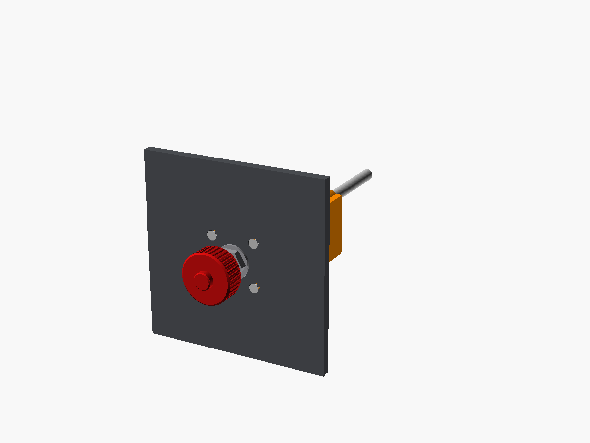
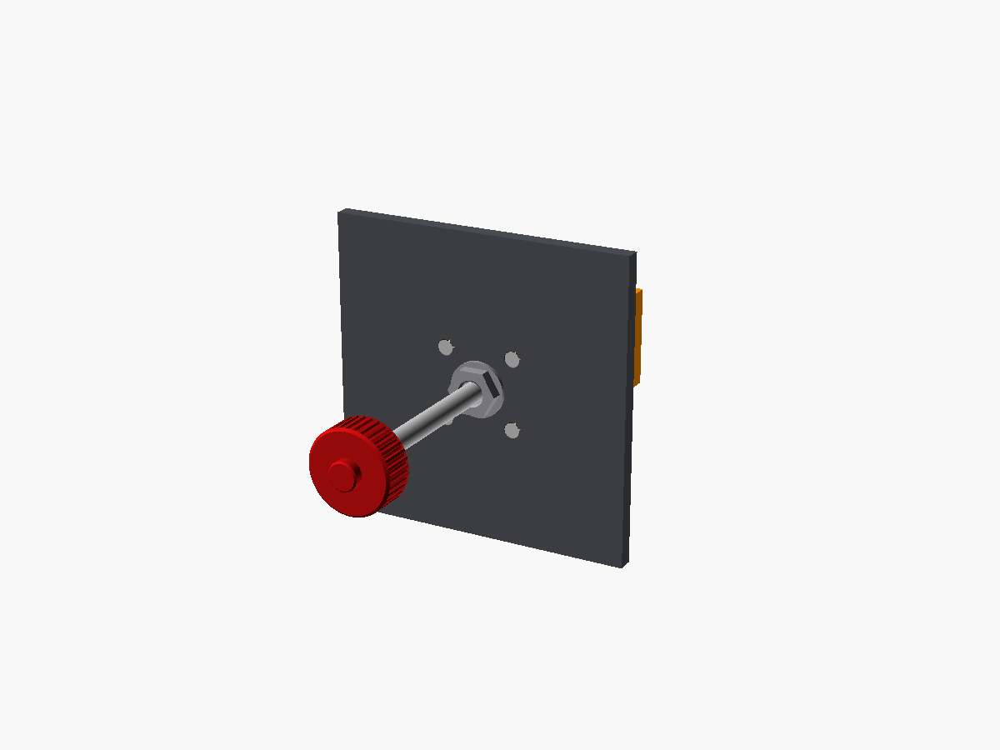
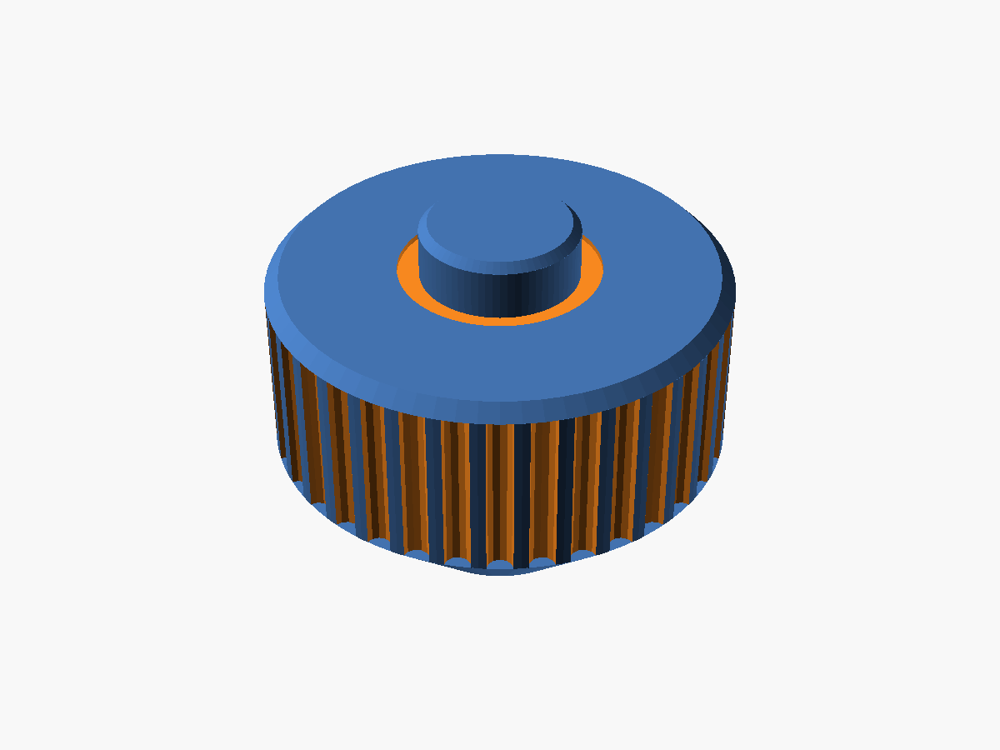

# Mixture

Red ribbed vernier-style knob with the centre lock button, on a hex bushing nut.

It uses the same mechanism, parts list and assembly as the throttle; see [`../throttle/README.md`](../throttle/README.md).

| Pushed in (rich) | Pulled out (idle cut-off) | Knob |
|---|---|---|
|  |  |  |

The button is moulded in as part of the knob, so it doesn't lock. You can use a filament change at the button layers to make it black, or paint it. Print the knob back-down.

Wire it to A1 (Y axis) in the Pro Micro sketch and bind it to *Mixture axis* in MSFS.
