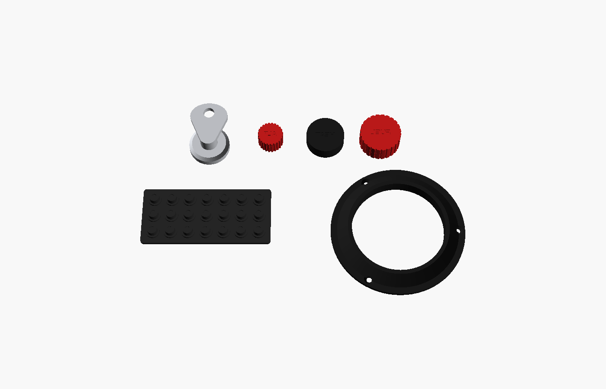

# Panel extras

| Part | What it is |
|---|---|
| `ignition_key` + `ignition_escutcheon` | Key-shaped knob and chrome-look ring on a 1-pole 12-position rotary switch (stop washer set to 5 positions). OFF R L BOTH START is engraved round it on the panel. |
| `knob_alt_static` | Red ALT STATIC AIR knob (look only) |
| `knob_cabin_heat`, `knob_cabin_air` | CABIN HT / CABIN AIR knobs (look only) |
| `knob_fuel_shutoff` | Red FUEL SHUTOFF knob on the pedestal (look only) |
| `knob_stem` + `stem_clip` | Holds any look-only knob in an 8.5 mm panel hole |
| `cb_strip` | A block of circuit-breaker heads; glue two on the lower panel |
| `yoke_boot` | Trim ring with a rubber-boot look round the yoke shaft opening (`yoke_hole_d`, default 60 mm) |

Print the knobs face down; their label is engraved in the face, so fill it with white paint. The key and escutcheon look best in silver.

