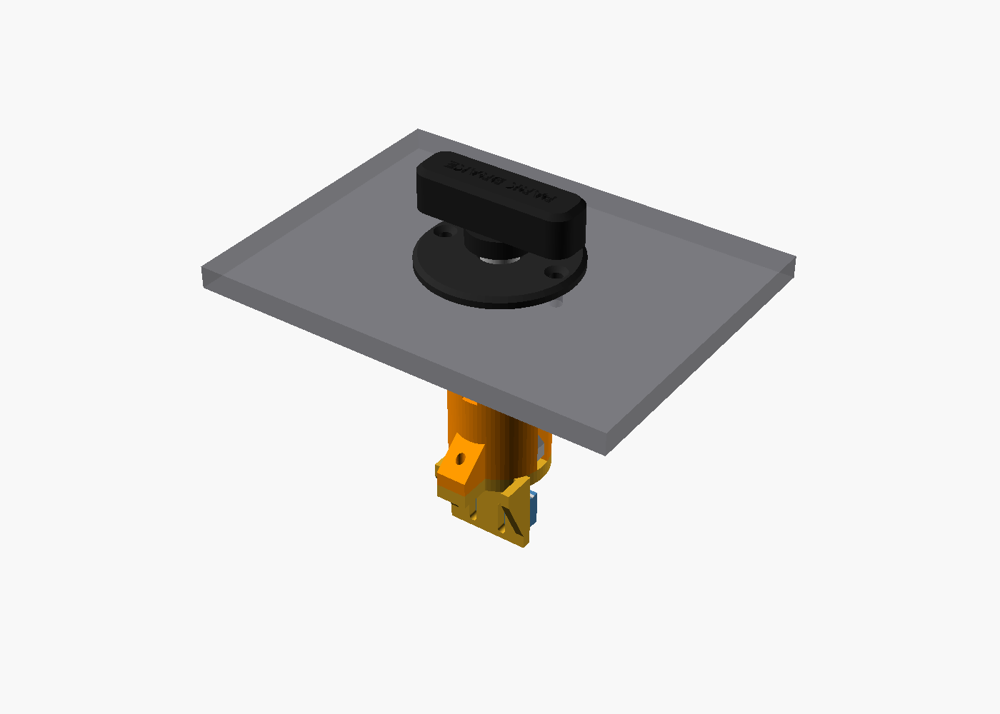
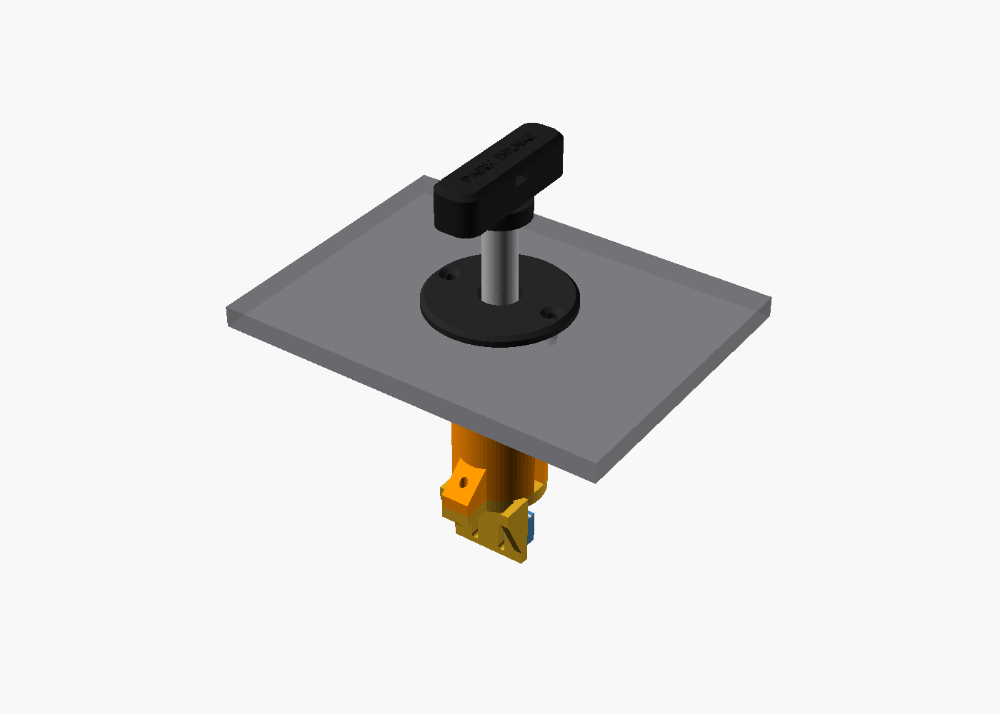
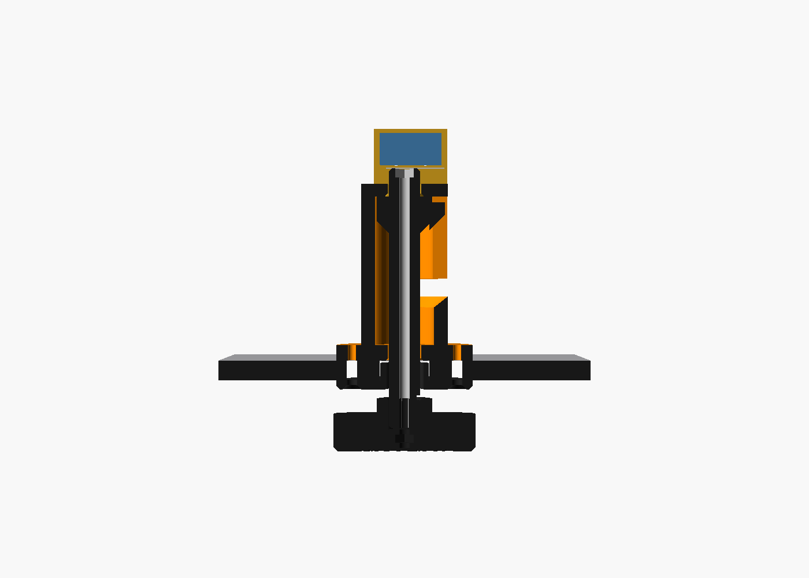
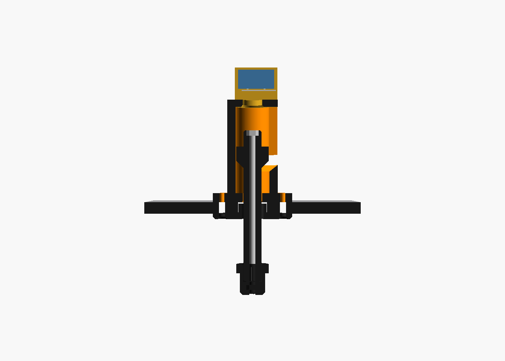
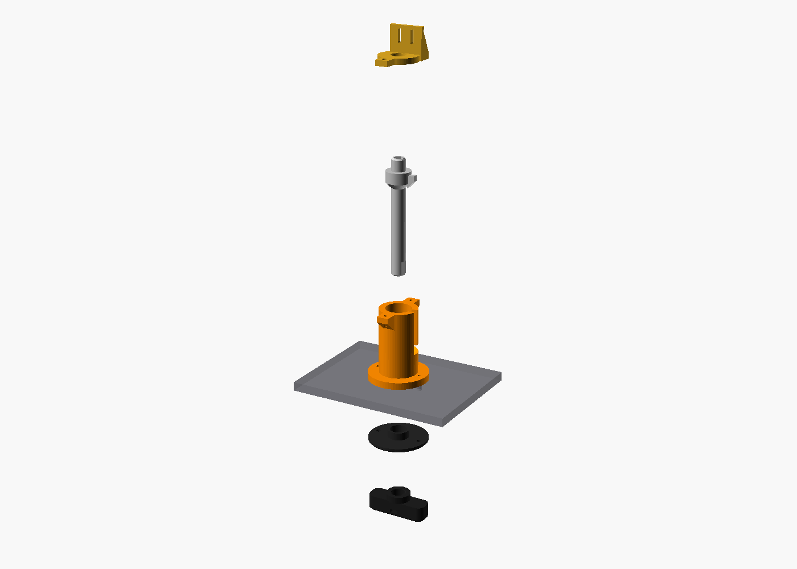

# Parking Brake

A Cessna 172-style pull-and-twist parking brake for a home sim panel.

To set it, pull the T-handle out and twist it 90°. The handle then drops into a detent and stays out. To release it, twist it back and the spring pulls it home. A microswitch on the back reports whether the handle is in or out, so the sim always matches the physical handle.

| Released | Set |
|---|---|
|  |  |

| Inside, released | Inside, set (lug in the detent) | Exploded |
|---|---|---|
|  |  |  |

## How it works

- **Housing:** a tube bolted to the back of the dash panel. An L-shaped (bayonet) slot is cut through its wall.
- **Shaft:** has a collar with a small lug that rides in that slot. The lug runs straight along the slot, so the handle can't twist until it's fully out. At the end of travel the slot turns 90°, then hooks back by 3 mm. The spring pulls the lug into that hook, which is what holds the brake set.
- **Spring:** sits between the front of the housing and the collar, so it's compressed when you pull the handle and pushes it back in when you release it.
- **Rear cap:** closes the housing and carries the microswitch. When the handle is pushed in, the end of the shaft presses the switch lever.
- **M3 threaded rod:** runs through the shaft and clamps the handle on. That keeps the printed shaft in compression, so a hard yank won't split it along the layer lines.

## Bill of materials

| Qty | Item | Notes |
|---|---|---|
| 1 each | Printed: `housing`, `shaft`, `handle`, `bezel`, `rear_cap` | STLs in [`stl/`](stl) |
| 1 | Compression spring, OD ≤ 17 mm, ID ≥ 11 mm, ~44 mm free length | Must compress to under 13 mm. Common assortment sizes like 1.0 × 14 × 45 mm work. |
| 1 | M3 threaded rod, ~87 mm | Cut from a longer rod |
| 2 | M3 nuts | One captured in the handle, one sunk into the shaft tail |
| 2 | M3 × 14 countersunk (flat head) screws | Bezel → panel → housing flange (for a 6.35 mm panel) |
| 2 | M3 × 8 pan or socket head screws | Rear cap → housing |
| 1 | Microswitch with hinge lever, 20 × 10 × 6.4 mm (KW11 / SS-5GL / V-153) | Must have COM / NO / NC terminals |
| 2 | M2 × 10 screws + nuts | Mount the microswitch |
| — | 2 wires to a spare button input on your GP-Wiz or other button board | |

The OpenSCAD file prints the exact screw length, rod length and spring limits for your panel thickness in its console output.

## Printing

| Part | Orientation (already set in the STL) | Notes |
|---|---|---|
| housing | Flange down | The ear supports are built in, so no supports needed |
| shaft | Nose (D-flat end) down | 4+ walls, 40%+ infill. The collar underside is a 45° cone, so no supports |
| handle | Back (socket) down, label up | Change filament at the label layer for contrasting text, or paint it in |
| bezel | Front face down | Countersinks are on the bed |
| rear_cap | Flat down | |

Material: PLA works, PETG is tougher. Layer height 0.2 mm. No supports for any part.

## Assembly

1. **Cut the panel** using [`panel-template/`](panel-template): a 16 mm hole with two 3.4 mm holes at ±17 mm, horizontal. Print the SVG at 100% and tape it on as a drill guide, or send the DXF to a laser or CNC.
2. **Load the shaft:** slide the spring over the shaft nose, then drop the shaft into the open rear of the housing. The nose goes through the front bore and the lug drops into the slot.
3. **Close the back:** screw the rear cap on with the 2 × M3 × 8 screws. Check that the handle pulls, twists and locks smoothly. If it binds, sand the slot or reprint with a higher `clearance`.
4. **Fit the switch:** mount it on the cap plate with M2 screws, lever pointing at the shaft tail. The plate has slots, so you can move the switch up or down until it clicks with the handle fully in and releases a few millimetres into the pull.
5. **Mount it:** hold the housing behind the panel and the bezel in front, then fit the two countersunk M3 screws from the front. The small dot on the flange marks 12 o'clock.
6. **Fit the handle:** put an M3 nut in the shaft tail. Thread the rod in from the front until it's flush with the back of that nut. Slide the second nut into the slot under the handle, push the handle onto the D-flat, and spin the rod into the handle nut until it's snug. Add a drop of thread-locker or CA glue once you're happy.

## Wiring

Wire the switch's **COM** and **NC** terminals to one button input.

- Handle in → the shaft presses the lever → NC opens → button **released** → brake **off**
- Handle out → lever free → NC closed → button **held** → brake **set**

Use NO instead of NC if you want the opposite logic.

## Binding in MSFS 2024

A switch that stays held (instead of a momentary button) needs **set** on press and **release** on release. A plain toggle binding will drift out of sync with the handle.

**MobiFlight (recommended):** add an input config for the button:
- On Press: `MSFS - Custom input` → `1 (>K:PARKING_BRAKE_SET)`
- On Release: `MSFS - Custom input` → `0 (>K:PARKING_BRAKE_SET)`

**Native bindings:** if your sim version lets you bind an action on button release, bind *Set parking brake* (on) to press and *Release parking brake* (off) to release.

Either way, check on the ground that the sim's parking brake follows the handle in both directions. Some add-on aircraft use their own L-vars for the parking brake.

## Customising

Open `parking_brake.scad` in [OpenSCAD](https://openscad.org) (2021.01 or newer) and use the Customizer panel, or override values on the command line:

| Setting | Default | What it does |
|---|---|---|
| `panel_thickness` | 6.35 | Your dash panel thickness (in `common/sim_common.scad`) |
| `clearance` | 0.25 | Raise it if parts bind, lower it if they're sloppy |
| `use_heat_set_inserts` | false | Sizes the screw holes for M3 heat-set inserts |
| `travel` | 25 | Pull distance |
| `twist`, `twist_dir` | 90, 1 | Lock angle and direction (1 = clockwise as seen from the seat) |
| `handle_label` | PARK BRAKE | Text on the handle (empty string = none) |

To regenerate all STLs after a change, run `scripts/render.sh parking-brake` from the repo root, or `PANEL=3 scripts/render.sh` for a 3 mm panel.
