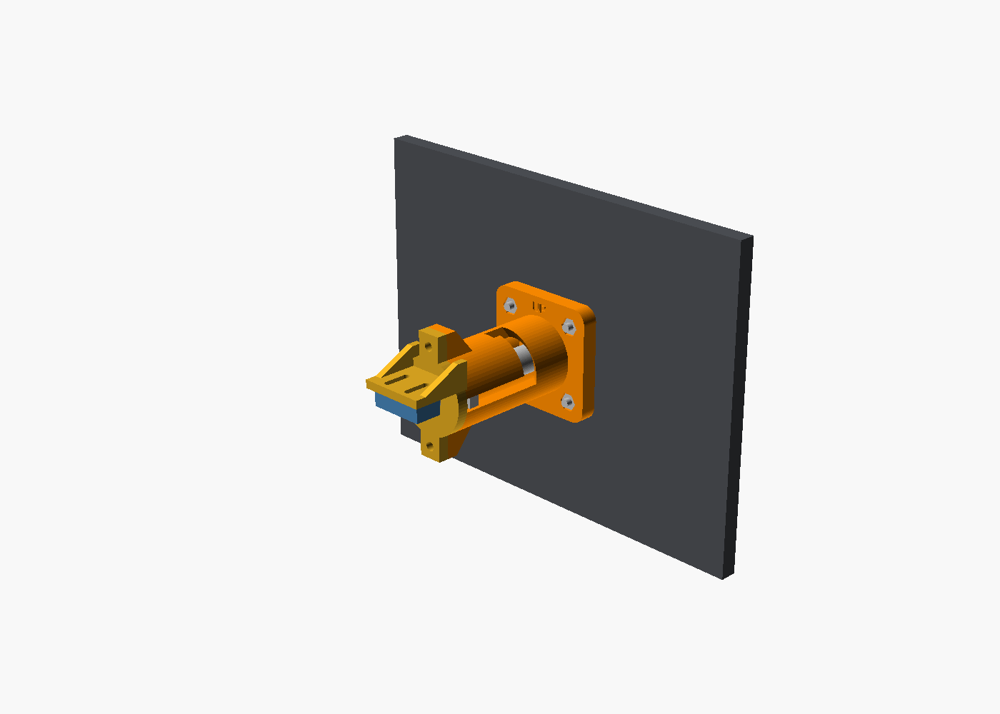

# Parking Brake

Modelled on the Cessna 172 parking brake: a black L-shaped lever on a 3/8" shaft that comes out of the lower panel, below the switch row and left of the throttle.

- **To set it:** pull the handle aft and rotate it 90° so the grip points down.
- **To release it:** rotate it back up. The spring pulls it home.

| Released | Set |
|---|---|
|  |  |

| Behind the panel | Exploded |
|---|---|
|  |  |

## How it works (kept simple)

- **Housing:** a printed tube bolted behind the panel, with an L-shaped slot cut in its wall.
- **Lug:** a small lug on the shaft rides in that slot. The handle can only rotate once it's fully out. At the end of the turn the lug drops into a 3 mm notch, and the spring holds it there.
- **Spring:** compressed when you pull, so it returns the handle when released.
- **Microswitch:** on the rear cap, pressed by the end of the shaft when the handle is in.
- **M3 threaded rod:** runs through the shaft and clamps the handle on, so the printed shaft is always in compression.

## Mounting to the panel

All controls in this repo mount the same way. Four M3 countersunk screws go in from the front of the panel, through the housing flange, and into M3 nuts sitting in hex pockets on the back of the flange.

- **Panel holes:** a 16 mm centre hole plus four 3.4 mm holes on a 28 × 28 mm square, countersunk on the front.
- **Template:** [`panel-template/`](panel-template) has an SVG to print at 100% and a DXF for a laser or CNC.
- **If you print your panel:** the cutouts are already in the files in [`/panel`](../../panel).
- **Escutcheon:** a small domed ring that hides the edge of the hole. Its spigot pushes into the hole; add a drop of glue.

## Parts list

| Qty | Item | Notes |
|---|---|---|
| 1 each | Printed: `housing`, `shaft`, `handle`, `escutcheon`, `rear_cap` | [`stl/`](stl) |
| 1 | Compression spring, OD ≤ 17 mm, ID ≥ 11 mm, ~44 mm long | Must compress below 13 mm. A 1.0 × 14 × 45 mm spring from an assortment works. |
| 1 | M3 threaded rod, ~90 mm | The exact length is printed in OpenSCAD's console |
| 2 | M3 nuts | One in the handle, one in the shaft tail |
| 4 + 4 | M3 × 14 countersunk screws + M3 nuts | Panel mount (6.35 mm panel) |
| 2 | M3 × 8 screws | Rear cap |
| 1 | Microswitch with lever, 20 × 10 × 6.4 mm (KW11 / SS-5GL / V-153) | |
| 2 | M2 × 10 screws + nuts | Microswitch |

## Printing

No supports are needed for any part; each STL is already in its print orientation. Use PLA or PETG at 0.2 mm layers, with 4 walls for the shaft and handle. Print the handle in black.

## Assembly

1. Slide the spring onto the shaft. Drop the shaft into the back of the housing so the nose comes out of the front and the lug enters the slot.
2. Screw on the rear cap and check that the handle pulls, twists and locks. If it binds, sand the slot or raise `clearance`.
3. Mount the microswitch on the cap. The plate has slots so you can slide the switch until it clicks with the handle fully in.
4. Bolt the housing behind the panel with "UP" at the top, then push the escutcheon into the hole from the front.
5. Put an M3 nut in the shaft tail and thread the rod through. Slide the second nut into the slot under the handle, push the handle onto the D-flat with the grip pointing right (brake off), and screw it tight.

## Wiring and sim

Wire the microswitch's **COM** and **NC** terminals to one input. The button is held while the brake is set.

- **With the Pro Micro sketch** in [`/firmware`](../../firmware): use pin 2. You get button 1 (held), plus button 2 (a pulse when the brake is set) and button 3 (a pulse when it's released).
- **In MSFS:** bind "set parking brake" to the press and "release parking brake" to the release. The most reliable way is a MobiFlight input with `1 (>K:PARKING_BRAKE_SET)` on press and `0 (>K:PARKING_BRAKE_SET)` on release.

## Options (OpenSCAD Customizer)

`stowed_side` (which way the grip points when off), `travel`, `grip_len`, `grip_rake`, `panel_thickness` and `clearance`.
