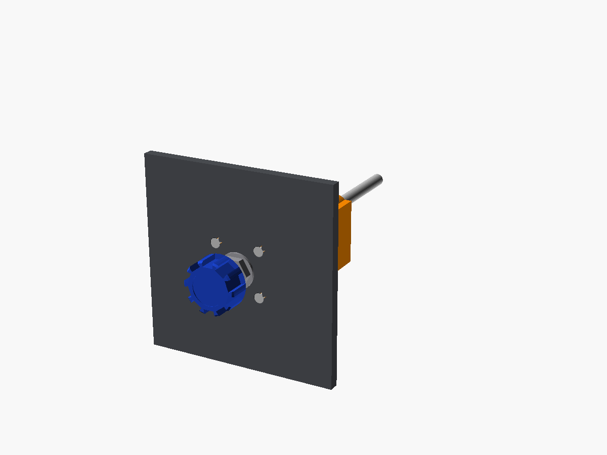
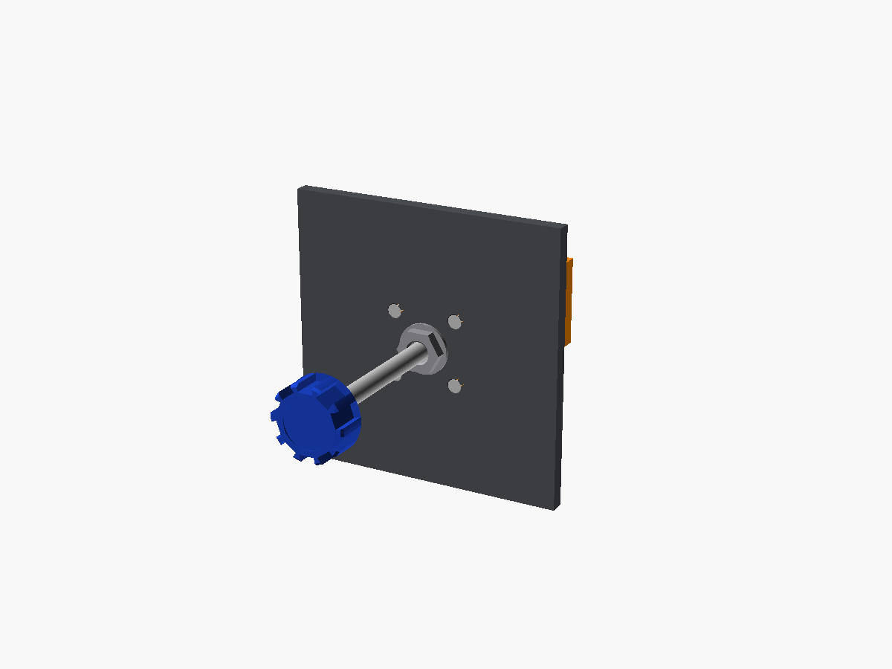
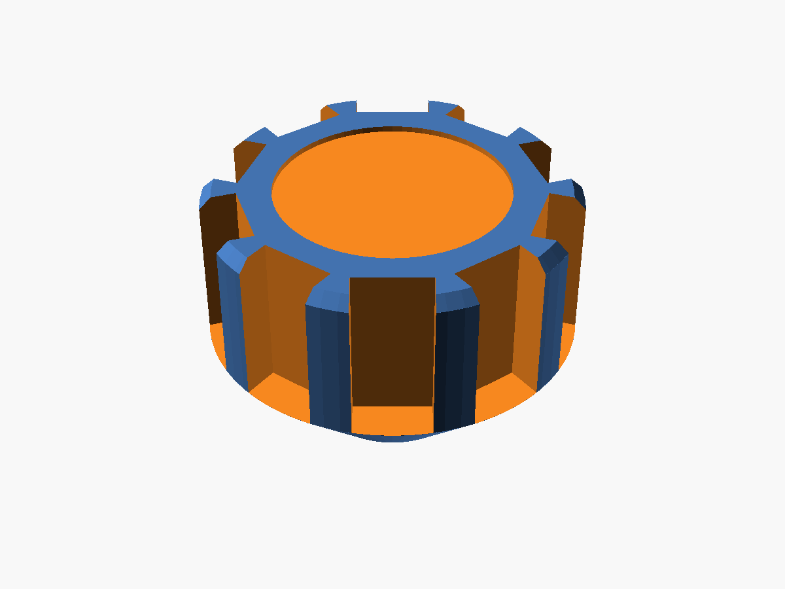

# Prop (constant-speed)

The 172 has a fixed-pitch prop, so the standard 172 doesn't have this control. Build it if you also fly constant-speed aircraft like the 172RG, 182 or Comanche. The knob is blue with a crenellated edge, on a hex bushing nut.

It uses the same mechanism, parts list and assembly as the throttle; see [`../throttle/README.md`](../throttle/README.md).

| Pushed in (high RPM) | Pulled out | Knob |
|---|---|---|
|  |  |  |

Wire it to A2 (Z axis) in the Pro Micro sketch, set `HAS_PROP = true` there, and bind it to *Propeller axis* in MSFS. To place it between the throttle and mixture on the printed panel, set `has_prop = true` in [`/panel`](../../panel).
