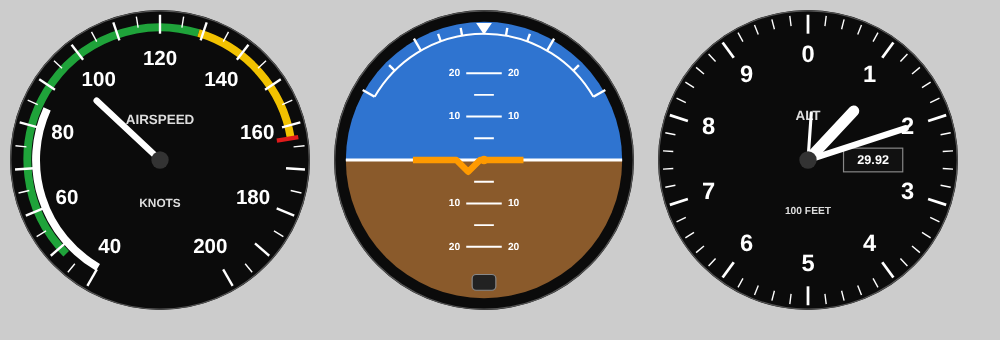

# Standby instruments

The standby airspeed, attitude and altimeter that sit below the G1000 screens. Each one is a printed 3-1/8" instrument case with a face you print on paper.

- **Case:** prints face down in black. A square bezel on the panel face, with a cup behind that goes through an 80 mm panel hole. 4 × M3 screws at the corners.
- **Face:** print [`faces/airspeed.svg`](faces/airspeed.svg), [`attitude.svg`](faces/attitude.svg) and [`altimeter.svg`](faces/altimeter.svg) at **100 %** on photo paper, cut them out, and glue them to the printed `face_disc`. A clear disc cut from a plastic sheet makes the glass.
- **Airspeed markings:** the 172S arcs in knots: white 40–85, green 48–129, yellow 129–163, red line at 163.
- **Static:** these instruments don't move; the screens show the live data. A 2.1" round LCD would fit the case later if you want them live.

To change the faces, run `python3 make_faces.py`, which rewrites the SVGs.
