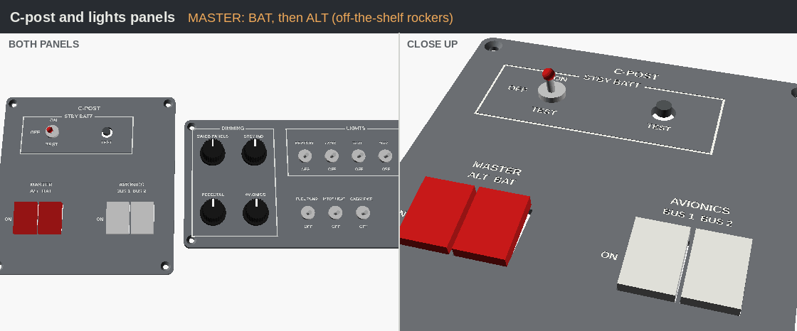
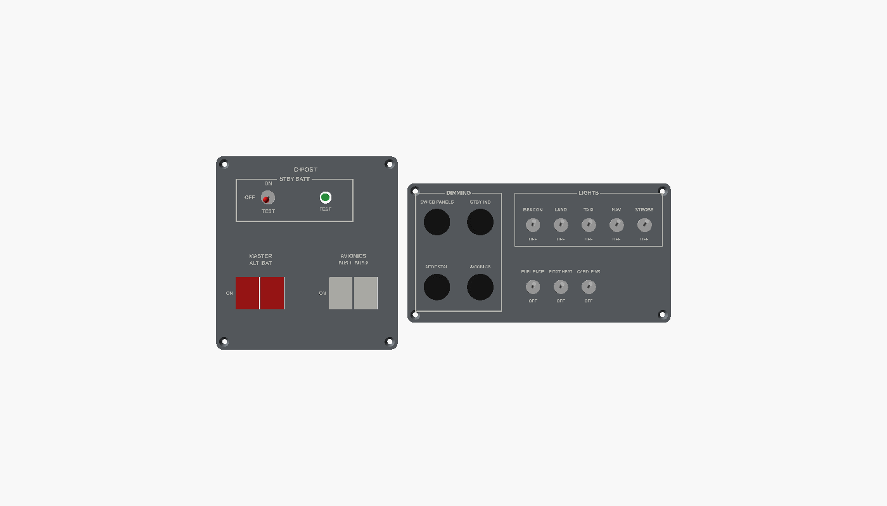

# Switch panels (C-post and lights / dimming)

The two switch plates on the left of the 172S G1000 panel, copied from the real layout:

- **C-post:** STBY BATT (3-position toggle, OFF / ON / TEST) with its test light, MASTER (red ALT | BAT rockers), and AVIONICS (BUS 1 | BUS 2 rockers).
- **Lights / dimming:** 4 dimmer knobs (SW/CB PANELS, STBY IND, PEDESTAL, AVIONICS), and toggles for BEACON, LAND, TAXI, NAV, STROBE, FUEL PUMP, PITOT HEAT and CABIN PWR.

Off-the-shelf switches clip or screw into the printed plates. The plates are printed face down in grey, with engraved labels you fill with white paint, and each screws over an opening in the dashboard with 4 × M3 countersunk screws.

## Parts list

| Qty | Item | Hole |
|---|---|---|
| 4 | Mini rocker switches, KCD1 style (2 red, 2 grey or white) | 15 × 21 mm (`rocker_hole`) |
| 9 | Mini toggle switches (MTS-102, 6 mm bushing); use an ON-OFF-ON for STBY BATT | 6.4 mm |
| 4 | 10 kΩ linear pots, 16 mm, 6 mm D shaft | 7.4 mm |
| 1 | 5 mm green LED + 220 Ω resistor | 8 mm (holder) |
| 4 | Printed `dimmer_knob` | |
| 8 | M3 × 12 countersunk screws | |

The plate is thinned to 2 mm round the rockers so their clips grip. If yours need a different cut-out, change `rocker_hole`, `toggle_hole_d` or `pot_hole_d`.

They're wired to board 3 in [`firmware/G1000_WIRING.md`](../../firmware/G1000_WIRING.md). With the AY210 base behind the panel its own 13 switches are out of reach, so these take over.
