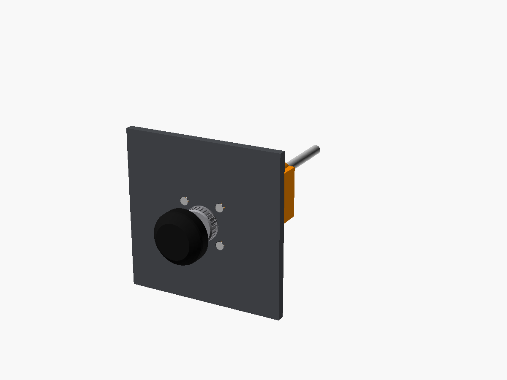
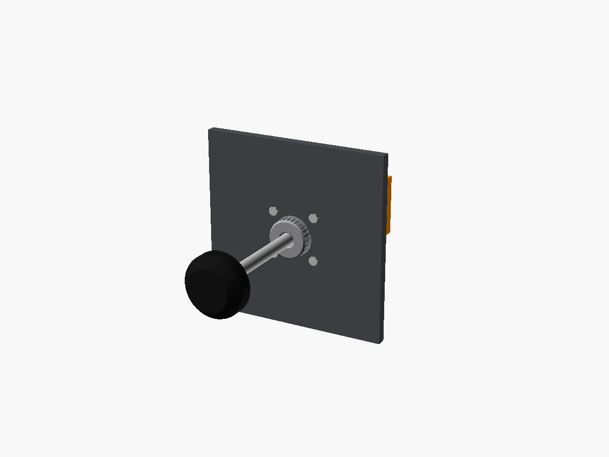
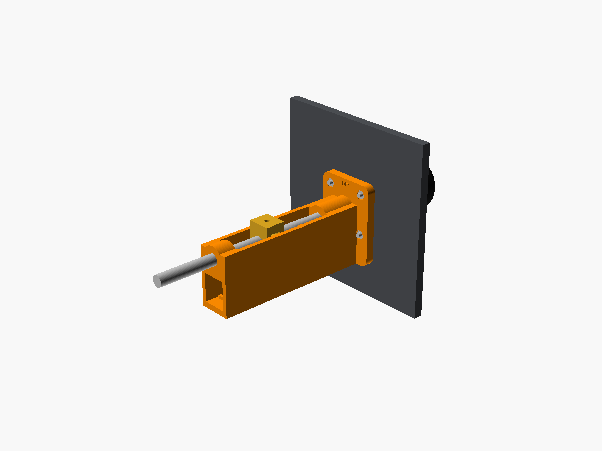

# Throttle (and the shared push-pull mechanism)

Throttle, mixture and prop all use the same simple mechanism. Only the knob and the panel nut change:

| Control | Knob | Panel nut | Folder |
|---|---|---|---|
| **Throttle** | Smooth round knob with a flat face. Print it black, or cream for older 172s | Knurled friction-lock nut | here |
| **Mixture** | Red, fine ribs around the edge, lock button in the centre (vernier style) | Hex bushing nut | [`../mixture`](../mixture) |
| **Prop** | Blue, crenellated edge (172RG / 182 / constant-speed) | Hex bushing nut | [`../prop`](../prop) |

| Pushed in | Pulled out | Behind the panel |
|---|---|---|
|  |  |  |

## How it works (kept simple)

- **Shaft:** an 8 mm smooth steel rod, the same rod 3D printers use, so it's cheap, straight and smooth. It slides through a printed U-channel bolted behind the panel.
- **Friction:** an 8 × 2 mm O-ring in the front bushing holds the knob wherever you leave it, like the friction lock on the real throttle.
- **Sensor:** a printed carriage clamped to the rod with an M3 set screw pushes the lever of a 60 mm slide potentiometer that sits in the bottom of the channel.
- **Travel:** 60 mm, set by the pot. The carriage hits the bushings before the pot reaches its own end stops.

## Parts list (per control)

| Qty | Item | Notes |
|---|---|---|
| 1 each | Printed: `knob`, `escutcheon`, `housing`, `carriage` | [`stl/`](stl) |
| 1 | 8 mm smooth rod, ~215 mm | OpenSCAD prints the exact length. Cut it with a hacksaw and file the ends. |
| 1 | 60 mm travel slide potentiometer, 10 kΩ linear (e.g. Bourns PTA6043) | Sits in the channel floor. Other sizes: change `pot_len`, `pot_w`, `pot_h`, `pot_lever_h` |
| 1 | O-ring, 8 mm ID × 2 mm | For friction |
| 1 + 1 | M3 × 8 set screw + M3 nut | Carriage clamp |
| 4 + 4 | M3 × 14 countersunk screws + M3 nuts | Panel mount |
| 2 | Zip ties | Hold the pot down |

## Printing

No supports needed.

- **housing:** lies on its floor. If the 8 mm bores come out tight, ream them with an 8.5 mm drill.
- **knob:** the throttle prints face-down; the mixture and prop print back-down. For the mixture, use a colour change to make the button black, or paint it.
- **escutcheon:** prints front face down.

## Assembly

1. Seat the O-ring in the groove inside the front bushing, then zip-tie the pot into the channel floor with its lever pointing up.
2. Push the rod in from the front through the bushing. Slide the carriage on with its slot over the pot lever, then push the rod on through the rear bushing.
3. Push the rod fully in and slide the carriage back against the rear bushing. Tighten the set screw.
4. Bolt the housing behind the panel with "UP" at the top. Push the escutcheon into the hole, then glue the knob onto the rod (CA or epoxy).

## Wiring and sim

Wire the pot ends to 5V and GND, and the wiper to an analog input. With the Pro Micro sketch in [`/firmware`](../../firmware): throttle on A0 (X axis), mixture on A1 (Y axis), prop on A2 (Z axis).

In MSFS, bind the axes to *Throttle axis*, *Mixture axis* and *Propeller axis*. If one works backwards, use the reverse option in MSFS or the `REVERSE_` setting in the sketch.

**Note:** the GP-Wiz is a button board, so it can't read these pots. That's why the Pro Micro sketch is included.
