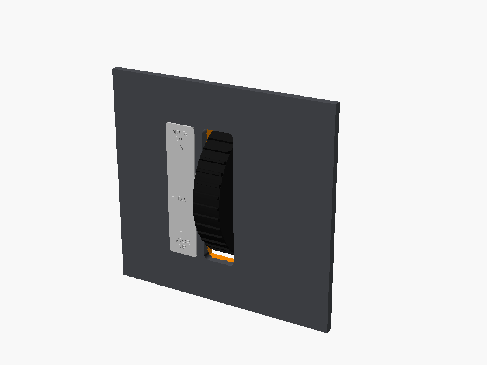
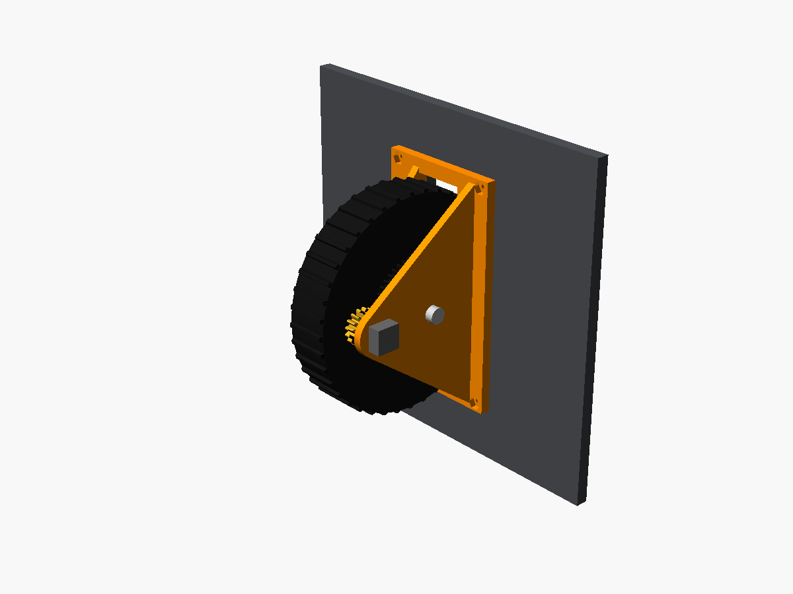
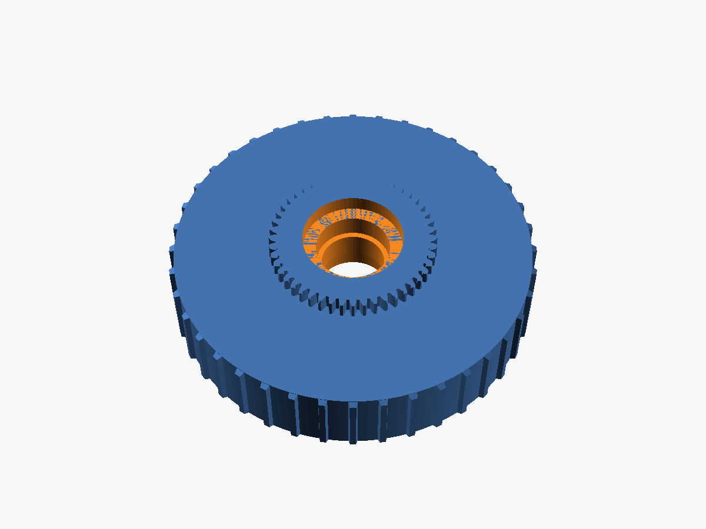

# Elevator Trim Wheel

The black ridged trim wheel from the 172's centre pedestal. It sticks out of a slot in the pedestal face, with a NOSE DN / T.O. / NOSE UP placard beside it. Roll the top forward for nose down, like the real one.

| Front | Behind the panel | Wheel |
|---|---|---|
|  |  |  |

## How it works (kept simple)

- **Bearings:** the wheel spins on an M8 bolt in two 608 skateboard bearings. Printed bosses on the side walls press on the inner races to keep it centred.
- **Sensor:** a gear moulded onto the side of the wheel (48 teeth) drives a 16-tooth gear on an EC11 rotary encoder. That's 3:1, so each click of the encoder is a small trim step. The real indicator needle isn't modelled; the placard shows the marks.

## Parts list

| Qty | Item | Notes |
|---|---|---|
| 1 each | Printed: `wheel`, `housing`, `encoder_gear`, `placard` | [`stl/`](stl) |
| 2 | 608 bearings (8 × 22 × 7 mm) | |
| 1 | M8 × 55 bolt + nyloc nut | Don't over-tighten: just snug on the bearing inner races |
| 1 | EC11 rotary encoder, 6 mm D shaft (20 detents) | **Cut its shaft to 12 mm** from the mounting face |
| 4 + 4 | M3 × 14 countersunk screws + M3 nuts | Panel mount |

## Printing

- **wheel:** prints flat with the gear side up. Print it in black.
- **housing:** prints with the front plate down. The walls stand up; the small horizontal bosses print fine without supports.
- **placard:** paint the plate black and dry-brush the raised letters white, or use a filament change.

## Assembly

1. Press the bearings into both sides of the wheel.
2. Mount the encoder on the outside of the gear-side wall: its bushing goes through the 7 mm hole, with the nut on the inside. Push the encoder gear onto the shaft.
3. Set the wheel between the walls and push the M8 bolt through. Check that the gears mesh and the wheel spins freely, then fit the nut.
4. Bolt the housing behind the pedestal face. The panel slot is 26 × 104 mm, with screws at ±27 / ±55 mm. Glue the placard beside the slot on the pilot's left.

## Wiring and sim

Encoder A → pin 7, B → pin 8, middle pin → GND, using the Pro Micro sketch in [`/firmware`](../../firmware).

Each click sends button 8 (nose down) or button 9 (nose up). Bind these to *Elevator trim down* and *Elevator trim up* in MSFS. If they come out backwards, set `REVERSE_TRIM = true` in the sketch.
